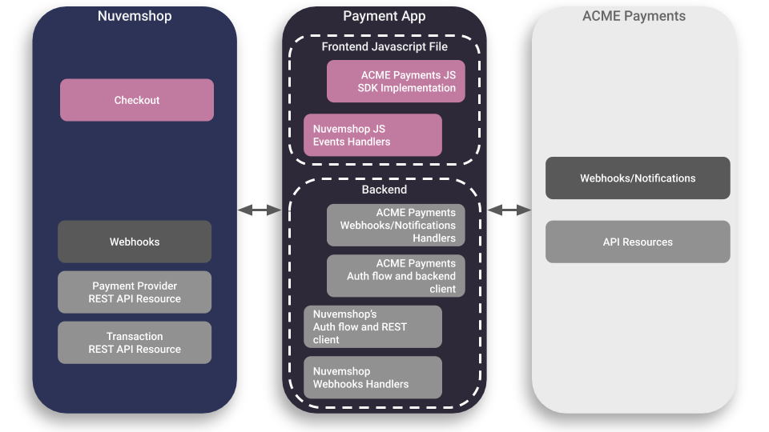
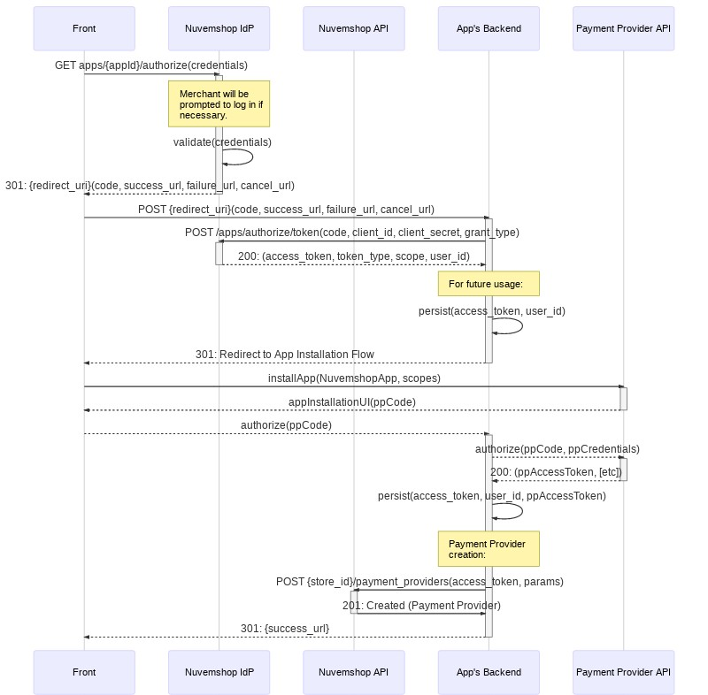
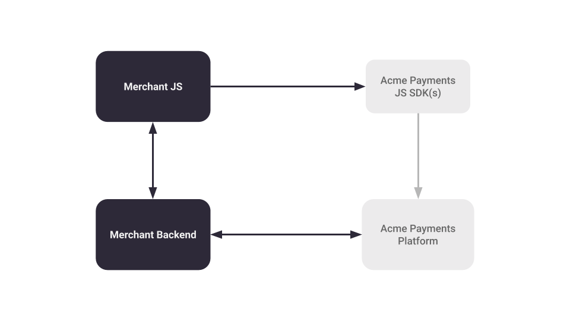
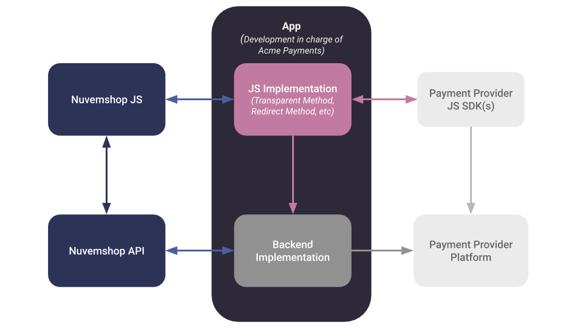
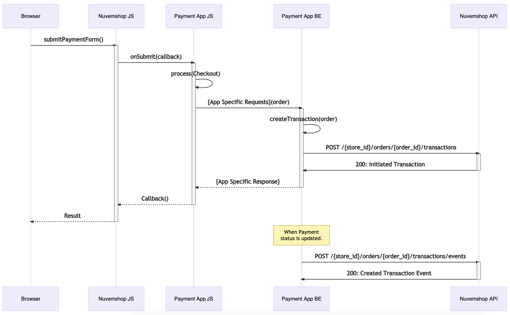

# Payment Provider App Development Guide

### Glossary

#### Payment Provider
Actually, short for *Payment Service Provider*, is any entity that provides all the necessary resources to allow a buyer to pay a merchant for purchased goods or hired services. These resources include information for the potential buyer about the available payment methods, installments, promotions, discounts, etc., as well as the technological resources to execute a payment.

#### Payment Method Type
The resource that allows a transfer of money from the consumer to the merchant. It can be any of, but not limited to:
- Credit card
- Debit card
- Bank debit (*aka "online debit"*)
- Boleto (*Brasil only*)
- PIX (*Brasil only*)
- Ticket (*aka "offline payment" or "payment voucher"*)
- Wire transfer (*between two bank accounts via traditional transfer*)
- Wallet (*i.e. customer's account credit*)
- Cash
- Others

#### Payment Method ID _(formerly known as plain Payment Method)_
For instance, if the Payment Method Type is *credit card*, then an example of Payment Method ID would be Visa, Mastecard or American Express. Some Payment Method Types, for example PIX, only have one Payment Method ID which happens to be PIX. Even though it's redundant, it leaves space to future variations.

#### Payment Option
The Payment Method is the resource that allows the transfer of money from the consumer to the merchant, while the Payment Option is how the Payment Method is used to execute the Transaction. In the physical world, if the selected Payment Method is *credit card*, then the payment could be executed using a card reader, or using an app that reads a QR code and has the credit card's information, etc.

A Payment Option has three main properties:
- The Payment Provider that will execute the Trasnsaction.
- One or more supported Payment Method Types.
- An Integration Type.

#### Integration Type
In terms of user experience, there might be different ways to integrate a Payment Option into a store. Some of them are:
 - _**Transparent:**_ All the process takes place in the store's website and all the relevant payment information are filled in a form rendered by the store, creating a seamless experience for the buyer.
- _**External:**_ At some point, the buyer is redirected to a website or app under the Payment Provider's domain where the buyer completes the payment process.
- _**Modal:**_ When the user submits our checkout, a modal rendered by the Payment Provider is displayed and the user finishes the payment process on it.

#### Payment App
The development of a Tiendanube/Nuvemshop Payment App, technologically speaking, more often than not, includes implementing our auth flow,  REST APIs and webhooks, as well as the Payment Provider's authentication flow, back-end-to-back-end APIs and webhook/notifications.

Also, a Payment App includes a JavaScript implementation of our platform's checkout event handlers. This event handlers usually make requests to the App's back-end, which in turn makes requests to the Payment Provider's APIs.



## Introduction

This document provides an explanation of what a Payment App is and will guide you through its development process.

In very few words, the steps to develop and deploy an App at our platform are:

1. The developer creates a partner account at the Nuvemshop Partner portal.
2. The developer creates a Payment App at the Partner portal.
3. The developer sets up a scalable back-end on their own infrastructure where the App will run.
4. The developer implements Nuvemshop's authorization flow.
5. The developer implements Nuvemshop's REST APIs, including the Payment Provider and the Transaction resources.
6. The developer implements their front-end scripts according to Nuvemshop’s JavaScript interface specifications, hosts the file in a public CDN and provides a link to the file through our API.
7. The app is audited by Nuvemshop to test the implementation, scalability, stability and other important quality factors.
8.  The App is released by Nuvemshop.

## Step 1: Partner Account and App Creation

To interact with our APIs, you must create an App. An App represents a partner's product in our platform. Each App has a set of credentials required to authenticate against our platform and be granted access to our APIs on behalf of the merchant, depending on the scopes enabled on the App’s settings.

The steps to create a Payment App are as follows:

1.  If your company doesn't already have a Partner0s account, it can be created at our [Partner Portal for Spanish LATAM](https://partners.tiendanube.com/) or at our [Partner Portal for Brasil](https://partners.nuvemshop.com.br/).
2.  At the Partner portal, create anAapp and make sure all the fields are completed with valid and real data (*Note: fake data can be set while the app is in development mode*).
3.  Take special care on the "redirect URI" which is a key part of the App installation process. You can modify it in the future, if necessary.
4.  You might want to include a good description of the payment services you offer, since our platform may bring new clients to your business.
5.  Make sure to choose the “Payments” category.
6.  Since you are creating a Payment App, make sure the App has the following scopes enabled on its configuration:
    - `read_payments`
    - `write_payments`
    - `read_orders`
    - `write_orders`

> **Important Note:** Our Payments API is not enabled by default to all partner accounts and stores. Please, contact our Platform Development team to enable our Payments API on your partner account and its demo stores.


## Step 2: App Installation and Payment Provider Creation Flow

A store can have `n` number of Payment Providers, and every store has their own Payment Providers with their own IDs and these are unrelated to the Payment Providers created by the same App on other stores. This means that each time a merchant installs your App, it must follow the Payment Provider creation flow for that App.

A Payment Provider object contain all the configuration to display payment methods, calculate prices, discounts, installments, among others, on the storefront and it also contains properties required for the checkout process.

The App installation flow is a standard OAuth 2 flow. The details on the App installation flow can be found [here](../../resources/authentication.md) and the details on creating a Payment Provider can be found in our [Payment Provider API Documentation](../../resources/payment_provider.md).

During this flow, the App is expected to create the Payment Provider on the merchant's store.

The following sequence helps to illustrate the process concept:
- *Front*: The web browser.
- *Nuvemshop IdP*: Nuvemshop's Identity Provider.
- *Nuvemshop API*: Self described.
- *Payment App*: Any host on the Payment Provider side.


Here's a less abstract example:
- *Front*: The web browser.
- *Nuvemshop IdP*: Nuvemshop's Identity Provider.
- *Nuvemshop API*: Self described.
- *App's Backend*: Place where both APIs, the one from Nuvemshop and the Payment Provider's one, live together.
- *Payment Provider API*: The original Payment Provider API.



#### Intalling an App

##### (1) Get the Authorization Code

Use the following URL to start the App installation flow in a store:

`https://<STORE_DOMAIN>.com/admin/apps/<APP_ID>/authorize`

> *Note:* Using placeholders for `store_domain` and `app_id`.

After accepting the application permissions, the merchant will be redirected to the `redirect URI` configured for the App, with the `authorization code` attached as a query string.

##### (2) Get the Access Token

```bash
curl --location --request POST 'https://www.tiendanube.com/apps/authorize/token' \
--header 'Content-Type: application/x-www-form-urlencoded' \
--data-urlencode 'client_id=<CLIENT_ID>' \
--data-urlencode 'client_secret=<CLIENT_SECRET>'' \
--data-urlencode 'grant_type=authorization_code' \
--data-urlencode 'code=<AUTHORIZATION_CODE>'
```

> *Note 1:* Using placeholders for `client_id`, `client_secret` and `authorization_code`.

> *Note 2:* `client_id` and `app_id` represent the same value.

### Payment Provider Configuration

You can find the list of Payment Provider object properties and their description in our [Payment Provider API Documentation](../../resources/payment_provider.md). All of the Payment Provider properties must have valid and real values (*Note: fake data can be set while the app is in development mode*).

*Quick example:*

```bash
curl --location --request POST 'https://api.tiendanube.com/v1/<STORE_ID>/payment_providers' \
--header 'Authentication: bearer <ACCESS_TOKEN>' \
--header 'Content-Type: application/json' \
--data-raw '{
	"name": "Acme Payments",
	"description": "This is a brief description about the Acme Payments app.",
	
	// Other Payment Provider properties.
}'
```

*See a full example [here]([../../resources/payment_provider.md#post-payment_providers).*

We strongly suggest taking a close look at each of the Payment Provider's object properties to identify which ones may involve special handling and which ones may depend on the merchant's account configuration on the Payment Provide's site. Here's a quick overview of some of the ones we think need extra attention:

#### Checkout Configuration

Most of our APIs are based on REST interfaces. However, our Checkout API are based on both, REST and JavaScript interfaces. For the Checkout API, the configuration is made through our REST API but the front-end interactions are handled by the JavaScript interface. This allows the app developer to implement their own JavaScript SDKs on our checkout's front-end without any intervention from our development team.

The Payment Provider has two checkout related properties:

- `checkout_payment_options`: List of Payment Options (such as `transparent`, `external` and `modal`), and their properties which include some like `name`, `logo_url` and `supported_payment_method_types`, among others.

- `checkout_js_url`: The handlers for each checkout payment option (such as `onLoad`, `onSubmit`, etc.) are implemented through our JavaScript API. This property contains a HTTPS URL pointing to the file with these implementations so our checkout can run them on the front-end. This URL will be requested from the front-end, which means that the JS file must be hosted on a CDN capable of handling high traffic.

***Note:*** The documentation of our Checkout API can be found [here](../../resources/checkout.md). Find more details about how to implement your own SDKs on the checkout JS file on the next section.

#### Supported Currencies

This property contains a list of supported currencies in [ISO 4217](https://www.currency-iso.org/en/home/tables/table-a1.html) format.

The content of this field usually depends on settings on the merchant's App account. It is important to set valid and real values on this field making sure it reflects the merchants settings to avoid any unexpected behaviour.

Nuvemshop will use this value as a reference to show (*allow*) or hide (*deny*) the Payment Provider to buyers based on several business rules. Incorrect supplied values may result in incorrect and/or unsupported transactions being executed.

#### Storefront Scripts

Note that our front-end has two main components: *Storefront* and *Checkout*.

In case any front-end JS script unrelated to the checkout process like, for example, a fraud prevention script such as a digital footprint, needed to be added to the merchant website's storefront, our API has a resource for that purpose. Details on how to implement it can be found following [this link](../../resources/script.md).

Any request to the Script API should be sent during the App's installation process. Your App will need an extra scope to access this resource: `write_scripts`. You must enable it at the App's configuration form on the Partner portal.

## Step 3: Implementing the Checkout Flow

Nuvemshop provides all the necessary REST and JavaScript APIs to allow 3rd Party developers to take care of the whole implementation in a completely autonomous way, without intervention from our development team at all.

To illustrate the "Payment App" concept, let's say we have a Payment Provider called "Acme Payments". Here's a classic implementation diagram:



And here's the Nuvemshop App implementation diagram:



### Available Checkout Payment Options

Currently, there are three main Checkout Payment Options. Below are quick descriptions of these to give some context and to align the reader with these concepts:

#### External Payment Option

Pretty much a standard redirect payment flow:

1. The merchant's website sends the order data to the Payment Provider.
2. The Payment Provider proccess the order, creates a *payment preference* and returns a redirect URL.
3. The buyer is redirected to the Payment Provider's website.
4. The buyer follows the checkout flow.
    - If the buyer has an account on the Payment Provider and *wallet* features are supported, this flow has a very smooth UX.
5. The buyer is redirected back to the merchant's website and lands on a success, failure or cancel page.

#### Transparent Payment Option

This approach keeps the buyer at the merchant's website during all the checkout process:

1. The form for each supported payment method is rendered on the merchant's website.
2. The order data together with the selected payment method information is sent to the Payment Provider.
   - The credit or debit card sensible information never goes in a readable way to the App's back-end, but under a security strategy such as tokenization, encryption, etc., so that the Payment Provider will be the only able to read it's content.

This option gives the buyer a more store-branded experience which improves the user experience quality.

#### Modal Payment Option
Some Payment Providers offer SDKs which render a lightbox or modal with an embedded *iframe* containing the Payment Provider's checkout UI on the merchant's website, giving the buyer a more transparent-like experience. In this case, though the buyer never really leaves the merchant's website, the checkout flow is run under the Payment Provider's domain.

This option allows the App to take full control of the front-end and render all the necessary elements to start the payment process.

> **Note:** This implementation requires a rigorous internal certification process.

### Checkout Payment Options Implementation (Checkout JS API)

As explained before, the developer is in charge of the JavaScript and REST implementations. The developer's JS implementation must follow our JS API specifications in order to properly integrate with our checkout. The file containing the app's JS implementation must be hosted on a CDN which must be able to handle potentially high traffic concurrency with, of course, a secure URL.

The App's checkout payment options script location must be indicated in the `checkout_js_url` property of the [Payment Provider](../../resources/payment_provider.md) object, which our checkout will fetch when needed.

[In this link](../../resources/checkout.md) you can find very detailed information on how the Checkout JS API is implemented. 

#### Adding a Checkout Payment Option

As explained previously on the *Checkout Configuration* section, Checkout Payment Options have two interfaces: the REST interface for Payment Provider's configuration and the JavaScript interface for front-end event handling.

Our front-end provides a context through the `LoadCheckoutPaymentContext()` global function. This function takes another function as parameter which in turn takes two arguments, a `Checkout` object and an object of the `PaymentOption` family.

Therefore, your JavaScript file should look like this:

```javascript
// acme.js
LoadCheckoutPaymentContext(function(Checkout, PaymentOptions) {
  // Your code here.
});
```
To add a payment option, the method `Checkout.addPaymentOption()` must be called passing an instance of one of the available `PaymentOptions` objects. This instance must be created with all the necessary event handlers and an `id` property with the same value as the one configured in the associated checkout payment option at the [Payment Provider](../../resources/payment_provider.md) object.

*A full description of the available PaymentOptions can be found [here](../../resources/checkout.md#paymentoptions).*

##### Transparent Card Implementation Example

Let's assume we've created a payment app called "Acme Payments" and now we want to implement a Transparent Card Option so the user can pay with a credit or debit card inside the store checkout. So, we have to create an instance of `PaymentOptions.Transparent.CardPayment` and add it to the Checkout by using the `Checkout.addPaymentOption()` method:

```javascript
// acme.js
LoadCheckoutPaymentContext(function(Checkout, PaymentOptions) {
  
  // We create an instance of the transparent card payment option.
  
  var AcmeTransparentCardPaymentOption = new PaymentOptions.Transparent.CardPayment({
    id: "acme_transparent_card", // Same `id` as in the REST API checkout payment option.
    
    // We indicate which extra fields we want to render in the form.
    fields: {
      card_holder_id_number: true
    },
    
    // `onLoad` handler is common to all `PaymentOtpions`. 
    onLoad: function() {
      // Do something after the script loads.
    },
    
    // `onDataChange` handler is specific to `Transparent.CardPayment` option.
    onDataChange: Checkout.utils.throttle(function() {
      // It can be used to, for example, read the card data, perform validations, refresh the installments data, etc.
    }, 700),
    
    // `onSubmit` handler is common to all `PaymentOtpions`. 
    onSubmit: function() {
      // Do something when user submits the payment.
    },
    
    // More handlers...
  });
  
  // Finally, we add the Payment Option to the Checkout object so it can be render according to the configuration set on the Payment Provider.
  
  Checkout.addPaymentOption(AcmeTransparentCardPaymentOption);
});
```

`PaymentOptions.Transparent.CardPayment` takes care of rendering the card form and any information which may be relevant to the user, such as the available card brands and banks, and the installments data.

The  `fields` porperty lets you select which optional input fields must be rendered on the card form. More information and a list of the available *fields* for this payment option can be found [here](../../resources/checkout.md#cardpayment).

The handler `onDataChange` will be invoked every time the object `Checkout.data` is modified. This handler should implement  business rules to validate the card's information and to update the installments data that is displayed to the buyer.

##### External Payment Implementation Example
Let's assume we've created a payment app called "Acme Payments" and now we want to implement an External Payment Option so the user can paid from Acme's website. So, we have to create an instance of `PaymentOptions.ExternalPayment` and add it to the Checkout by using the `Checkout.addPaymentOption()` method:

```javascript
// acme.js
LoadCheckoutPaymentContext(function(Checkout, PaymentOptions) {
  
  // We create an instance of the external payment option.
  
  var AcmeExternalPaymentOption = new PaymentOptions.ExternalPayment({
    id: 'acme_external', // Same `id` as in the REST API checkout payment option.
    
    // Define all necessary handlers here.
  });
  
  Checkout.addPaymentOption(AcmeExternalPaymentOption);
});
```

#### Available Information about the Ongoing Sale
The *Checkout* object provides the app with access to all the data related to the ongoing sale. We've got the following data groups:

- Cart Information: `Checkout.data.order.cart`.
- Total cart price: `Checkout.data.totalPrice` (also indicated by `Checkout.data.order.cart.prices.total`).
- ID of the store to which the cart belongs: `Checkout.data.storeId`.
- Customer Contact Information: `Checkout.data.order.contact`.
- Billing Information: `Checkout.data.order.billingAddress`.
- Shipping Information: `Checkout.data.order.shippingAddress`.
- Shipping Method Information: `Checkout.data.order.cart.shipping`.
- Payment Method Information: `Checkout.data.form`.

#### Form Data

Some SDKs have mechanisms to render forms using field names as required. To protect the UI and provide the user with a clean and smooth user experience, all forms are rendered by our own code following our standards with custom field names, as explained above.

The object `Checkout.data.form` provides access to all the form fields. The payment method implementation must map each of the provided fields to the Payment Provider specific ones. In cases where a form with specific attributes needs to be submitted, we recommend using workarounds such as dynamically creating a hidden HTML form and submitting it using JavaScript.

Take into account that it is possible to request the consumer with more payment method information by rendering the optional fields on the form, depending on the selected payment method.

The available *fields* are:
- [Card Payment](../../resources/checkout.md#cardpayment)
- [Debit Payment](../../resources/checkout.md#debitpayment)
- [Boleto Payment](../../resources/checkout.md#boletopayment)
- [Ticket Payment](../../resources/checkout.md#ticketpayment)
- [PIX Payment](../../resources/checkout.md#pixpayment)

Details on how to render the optional ones can be found [here](../../resources/checkout.md#fields-property).

#### Adding Multiple Payment Options
Any number of payment options can be added to the checkout, combining external and transparent options as prefered. Nuvemshop's checkout may filter and hide some of them due to UX business rules being applied in order to improve the conversion rate.

For example, if "Acme Payments" wants to add three different payment options, one for their own _external checkout_, one for _transparent card_ and another one for _transparent boleto_, the Payment Provider must specify the following `checkout_payment_options`:

```json
{
  "name": "Acme Payments",
  "checkout_js_url": "https://cdn.acme.com/js/acme.js",
    
  // Most of the Payment Provider properties are being omitted for better readability.
    
  "checkout_payment_options": [
    {
      "id": "acme_external",
      "name": "...",
      "description": "...",
      "logo_url": "...",
      "supported_billing_countries": [
        "BR"
      ],
      "supported_payment_method_types": [
        "credit_card",
        "debit_card",
        "boleto",
        "pix",
        "wire_transfer",
        "wallet"
      ]
    },
    {
      "id": "acme_transparent_card",
      "name": "...",
      "description": "...",
      "logo_url": "...",
      "supported_billing_countries": [
        "BR"
      ],
      "supported_payment_method_types": [
        "credit_card",
        "debit_card"
      ]
    },
    {
      "id": "acme_transparent_boleto",
      "name": "...",
      "description": "...",
      "logo_url": "...",
      "supported_billing_countries": [
        "BR"
      ],
      "supported_payment_method_types": [
        "boleto"
      ]
    }
  ]
}
```

Then, the JavaScript implementation must have an instance for each *checkout payment option* defined in the Payment Provider configuration:

```javascript
LoadCheckoutPaymentContext(function(Checkout, PaymentOptions) {
  
  let AcmeExternalPaymentOption = PaymentOptions.ExternalPayment({
    id: 'acme_external',
    fields: {...},
    scripts: 'https://...',
    onLoad: function(){...},
    onSubmit: function(callback){...}
  });


  let AcmeTransparentCardPaymentOption = PaymentOptions.Transparent.CardPayment({
    id: 'acme_transparent_card',
    fields: {...},
    scripts: 'https://...',
    onLoad: function(){...},
    onDataChange: function(){...},
    onSubmit: function(callback){...}
  });

  let AcmeBoletoPaymentOption = PaymentOptions.Transparent.BoletoPayment({
    id: 'acme_transparent_boleto',
    fields: {...},
    scripts: 'https://...',
    onLoad: function(){...},
    onSubmit: function(callback){...}
  });

  Checkout.add(AcmeExternalPaymentOption);
  Checkout.add(AcmeTransparentCardPaymentOption);
  Checkout.add(AcmeBoletoPaymentOption);
});
```

The script can have any number of checkout payment option instances, however, only those specified on the Payment Provider will be loaded. This allows the developer to have one static JavaScript file with logic for all configurations and then manage the available payment options for each store by adding them or not to the Payment Provider object.

## Step 4: Transactions Implementation

Payment apps work with orders. However, we don't provide any endpoint to directly change an order's payment status. That's where Transactions come in.

A Nuvemshop order can have many Transactions. A Transaction represents a single intention of moving money. If, for any reason (e.g. "insufficient funds") a Transaction failed, the next buyer's attempt to pay for the order would be a new Transaction. Likewise, an order paid with two credit cards would have one Transaction per credit card since two movements of money are being performed.

An order will automatically calculate its current payment status by checking all of its related Transactions and applying some business rules.

*The full Transaction resource specification can be found [here](../../resources/transaction.md#transaction).*

### Creating a Transaction
The App's back-end must `POST` a Transaction to our platform as soon a one is created on the Payment Provider's side.

A Transaction not only helps to calculate an order payment status but also provides detailed information about the payment process so that the merchant can have full autonomy when handling orders and dealing with payment issues. Also, this information is always important to help the merchant with feature business decisions.

As a reference, here are two examples of the implementation of the `POST` Transaction request.

*Example with transparent payment option:*



*Example with external payment option:*


### Transaction Properties

To ensure the best visibility on payments to both buyers and merchants,, it's very important to provide as much information as possible about each Transaction.

The [TransactionInfo](../../resources/transaction.md#transaction-info) object should be completed with all the information required for each payment method.

### Updating a Transaction

Nuvemshop's Transaction API is designed to reflect transactions that already exist and events related to those transactions that have already happened. Our Transaction API will automatically calculate the Transactions `status` on every [TransactionEvent](../../resources/transaction.md#transaction-events) reported by the Payment Provider using the [TransactionEvent endpoint](../../resources/transaction.md#transaction-eventspost-ordersorder_idtransactionstransaction_idevents).

### Transaction Event workflows
The possible `TransactionEvents` a Transaction can receive depend on the possible workflows for each Payment Method Type.

The payment methods `boleto`, `ticket`, `bank_debit`, `debit_card`, `wallet`, `wire_transfer`, `cash` and `pix`, all share the same events workflow.

On the other hand, `credit_card` has its own workflow to support all the transaction events specific to this payment method type.

## Order Management: Refunds and Chargebacks
Currently, customers can't cancel orders from their purchase tracking page. In case they want to cancel a purchase, they will need to contact the seller.

#### Refunds

Merchants will be able to refund orders in two ways: from the store's dashboard or from the payment provider's dashboard.

If your App supports Transaction refunds, then you must specify a *refund URL* within the Transaction data every time you create one. In this way, when merchants want to cancel an order from the store's dashboard, they will have the possibility of returning the money to the consumer. If this is so, Nuvemshop will notify your App of the refund intention through the *refund URL* specified for the Transaction related to the order. For more details on the implementation of the refund URL, visit the following [link](../../resources/transaction.md#Refund-URL).

Likewise, if your App supports it, merchants could also perform Transaction refunds from the Payment Provider dashboard.

Either way, once a Transaction is refunded, then a `TransactionEvent` of type `refund` must be posted for the corresponding Nuvemshop's Transaction.

#### Chargebacks

Chargebacks are not supported at the moment, but we're looking forward to support them soon.

## Infrastructure
It is important to take into account that Nuvemshop is a platform with 70K+ stores. This means the App's back-end will need to be able to handle high-traffic loads. All the necessary scaling, performance monitoring and alert triggering architecture must be implemented.

Special dates like Black Friday, Cyber Monday and Hot Sale should be handled with care. Your App should be able to sustain heavy loads with multiple very high traffic peaks.

## App Metadata
The payments configuration dashboard of a store displays the available Payment Apps for that store so that the merchant can directly install them from there, instead of having to visit the App Store. Our Partner panel currently does not support to configure specific parameters of a *payment* application category, such as information about transaction costs (*rates*), supported payment methods, etc. However, our support team will gladly set up that information for you.

The Payment App metadata information is country specific, so, if your App will be published in several countries, you'll need to provide a JSON for each country.

***Note:*** All fields in the metadata object are *optional*. However, it is required to provide the merchant with a way to check the App's rate information. Therefore, one of the `rates_url` or `rates` fields must be specified so that the App can be available to stores.

*Here is an example of what a JSON would look like for the metadata of a Payment App:*

```json
{
    "type":"aggregator",
    "name": "Acme Payments",
    "logo_urls":{
       "400x120":"https://cdn.acme.com/logos/400x120.png"
    },
    "description": "This is a brief description about the Acme Payments app.",
    "installation_description":"This is a brief description of the installation process for the Acme Payments app.",
    "rates_url":"https://acme.com/rates",
    "register_url":"https://acme.com/register",
    "support_phone":"+54123456789",
    "supported_payment_method_types":[
       "credit_card",
       "wallet"
    ],
    "features":[
       "gateway",
       "special_rates",
       "transparent_checkout"
    ],
    "rates":[
       {
          "payment_method_type":"credit_card",
          "rates_definition":[
             {
                "percent_fee":"2.15",
                "flat_fee":{
                   "currency":"ARS",
                   "value":"1.00"
                },
                "plus_tax":true,
                "days_to_withdraw_money":14
             }
          ]
       },
       {
          "payment_method_type":"wallet",
          "rates_definition":[
             {
                "percent_fee":"1.5",
                "flat_fee":{
                   "currency":"ARS",
                   "value":"1.00"
                },
                "plus_tax":true,
                "days_to_withdraw_money":7
             }
          ]
       }
    ]
 }
```

