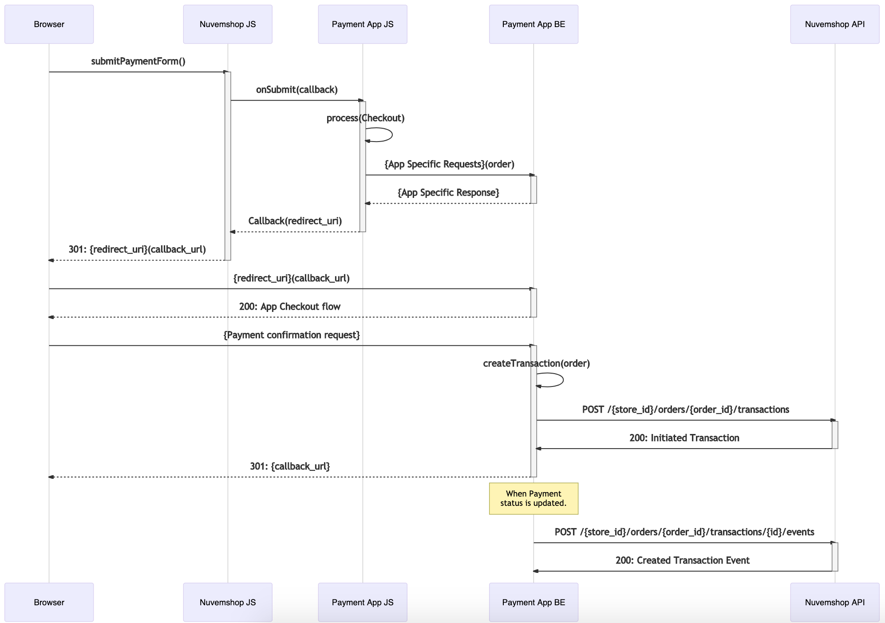

# Payment Provider App Development Guide

### Glossary

#### Payment Provider
Actually, short for Payment Service Provider, is any entity the provides all the necessary resources to allow a buyer to pay the merchant for purchased goods or hired services. These _resources_ include information for the potential buyer about the available payment methods, installments, promotions, discounts, etc, as well as the technological resources to actually execute a payment.

#### Payment Method Type
The resource that allows a transfer of a money from the consumer to the merchant. It can be any of, but not limited to:
- Credit Card
- Debit Card
- Bank Debit
- Boleto _(Brasil only)_
- PIX _(Brasil only)
- Ticket _(e.g. Pago Fácil, RapiPago, etc)_
- Wire Transfer _(Between two bank accounts via "traditional" transfer)_
- Wallet _(i.e. customer's account credit)_
- Cash
- Others

#### Payment Method Id _(formerly known as plain Payment Method)_
For instance, if the Payment Method Type is Credit Card, then an example Payment Method Id would be Visa, Mastecard or American Express. Some Payment Method Types, for example Bank Debit, only have one Payment Method Id which happens to be Bank Debit. Though it's redundant, it leaves space for future variations.

#### Payment Option
The Payment Method is the resource that will allow the transfer of money from the consumer to the merchant, while the Payment Option would be how the Payment Method will be used to execute the transaction. In the physical world, if the selected Payment Method is credit card, then the payment could be executed using an app that reads a QR code an has the credit card's information stored, or using a card reader, etc.

Hence, a Payment Option has two main properties:
- The Payment Provider that will execute the trasnsaction.
- One or more supported Payment Method Types.
- An Integration Type.

#### Integration Type
In terms of user experience, there might be different ways to integrate a Payment Method into a store. Some of them are:
 - _**Transparent:**_ All the process takes place in the store's website and all the relevant payment information, such as credit card data, are filled in a form rendered by the store, creating a seamless experience for the buyer.
- _**External:**_ At some point, the buyer is redirected to a website or app under the Payment Providers's domain where the buyer will finish the payment process.
- _**Modal:**_ When the user submits our checkout, a modal rendered by the Payment Provider is displayed and the user finishes the payment process in the modal.

In the physical world, the integration types for, for example, credit card, could be a card reader, an app that reads a QR code and has the card's information stored, etc.

#### Payment App
The development of a _Nuvemshop_ Payment App, technologically speaking, more often than not, includes implementing Nuvemshop's auth flow,  REST APIs and webhooks, as well as the payment provider's authentication flow, backend-to-backend APIs and webhook/notifications.

Also, a Payment Apps includes a Javascript implementation of Nuvemshop's checkout event handlers. This event handlers usually make requests to the app's backend which, in turn makes requests to the payment provider's backend-to-backend APIs.


## Introduction

This document provides an explanation of what a Payment App is and will guide you through the development process.

In very few words, the steps to develop and deploy an app are:

1. The developer creates a partner account at Nuvemshop’s Partner’s Portal.
2. The developer creates a payments app at Nuvemshop’s Partner’s Portal
3. The developer sets up a scalable backend on their own infrastructure where the app will run.
4. The developer implements Nuvemshop’s authorization flow.
5. The developer implements Nuvemshop’s REST APIs, including the Payment Provider and Transaction resources.
6. The developer implements their frontend scripts according to Nuvemshop’s JS interface specifications, hosts the file in a public CDN and provides a link to the file or files through our APIs.
7. The app is audited by Nuvemshop to test the implementation, scalability, stability, and other important factors.
8.  The app is released by Nuvemshop.

## Step 1: Partner account and App creation

To interact with our APIs, you must create an App. An App represents our partner’s products in our platform. Each App has a set of credentials required to authenticate against our platform and be granted access to our APIs on behalf of the merchant depending on the scopes enabled on the App’s settings.

The steps to create a Payment App are the following:

1.  If your company doesn’t already have a Partner’s Account, it can be created at our [Partner’s Portal for Spanish LATAM](https://partners.tiendanube.com/) or at our [Partner’s Portal for Brasil](https://partners.nuvemshop.com.br/).
2.  At the Partner’s Portal, create an app and make sure all the fields are completed with valid and real data.
3.  Take special care on the “Redirect URI” which is a key part of the App installation process. You can modify it in the future, if necessary.
4.  You might want to include a good description of your offered payment services, since our platform may bring new clients to your business.
5.  Make sure to choose the “Payments” category.
6.  Since you are creating a Payment App, make sure the App has the following scopes enabled on the Portal:
    - `read_payments`
    - `write_payments`
    - `read_orders`
    - `write_orders`

> **IMPORTANT NOTE:** Our Payments API is not enabled by default to all consumers. Please, contact our Platform Development team to enable our Payments API on your partner account and its demo store.
    

## Step 2: App installation and Payment Provider creation flow

A `Store` can have `n` number of `Payment Providers`. `Stores` have their own `Payment Providers` with their own `id`s and these are unrelated to `Payment Providers` created by the same app on other `Stores`. This means that each time a merchant installs your app, your App must follow the `Payment Provider` creation flow for that App.

`Payment Providers` contain all the configuration to display `payment_methods`, calculate prices, discounts, installments, among others, on the storefront and it also contains properties required for the Checkout process.

The App installation flow is a standard OAuth 2 flow. The details on the App installation flow can be found [here](../../resources/authentication.md) and details on creating a Payment Provider can be found [here](../../resources/payment_provider.md#post-store_idpayment_providers).

During this flow, the App is expected to create the Payment Provider on the merchant’s store.

The following sequence helps illustrate the process' concept:
- *Front*: The web browser.
- *Nuvemshop IdP*: Nuvemshop’s Identity Provider.
- *Nuvemshop API*: Self described.
- *Payment App*: Any hosts on the Payment Provider’s side.


Here's a less abstract example:
- *Front*: The web browser.
- *Nuvemshop IdP*: Nuvemshop’s Identity Provider.
- *Nuvemshop API*: Self described.
- *App's Backend*: Actually, _"Payment Apps's Backend"_, where both REST APIs implementaitons, Nuvemshop's and the payment provider's ones, live together.
- *Payment Provider API*: The original payment provider's API.


#### Intalling an app

##### (1) Get the Authorization Code

Use the following URL to start the app installation flow in a store:

`https://${store_name}.mitiendanube.com/admin/apps/${app_id}/authorize`

> Note: Using placeholders for:
> - `${store_name}`
> - `${app_id}`

After the Merchant approves the permissions, the Merchant is redirected to the App's redirect URI, which you can find in your app's configuration, with the `code` attached as a query string.

##### (2) Get the `access_token`

```bash
curl --location --request POST 'https://www.tiendanube.com/apps/authorize/token' \
--header 'Content-Type: application/x-www-form-urlencoded' \
--data-urlencode 'client_id=${client_id}' \
--data-urlencode 'client_secret=${client_secret}' \
--data-urlencode 'grant_type=authorization_code' \
--data-urlencode 'code=${client_secret}'
```

> **Note 1:** Using placeholders for:
> - `${code}`: From the query string of the Redirect URL.
> - `${client_secret}`
> - `${client_id}`

> **Note 2:** `${client_id}` and `${app_id}` represent the same value.

### Payment Provider Configuration

You can find the list  of Payment Provider object of properties and their description in our API’s Documentation, [here](../../resources/payment_provider.md#payment-provider-1). All of the Payment Provider object properties MUST have valid and real values.

Quick example:
```bash
curl --location --request POST 'https://api.tiendanube.com/v1/1077387/payment_providers' \
--header 'Authentication: bearer ${access_token}' \
--header 'User-Agent: ${app_name} (${partner_email})' \
--header 'Content-Type: application/json' \
--data-raw '{
  "name": "Acme Payments",
  "description": "Beat the roadrunner with Acme Payments.",
  "logo_urls": {
    "400x120": "https://cdn.acme.com/nuvemshop/images/logo-400x120.png",
    "160x100": "https://cdn.acme.com/nuvemshop/images/logo-160x100.png"
  },
  "configuration_url": "https://acme.com/users/me",
  "support_url": "https://acme.com/support",
  "checkout_js_url": "https://cdn.acme.com/nuvemshop/js/checkout-options.min.js",
  "checkout_payment_options": [
    {
      "id": "acme_aggregator_external",
      "name": "Acme Checkout",
      "description": "",
      "logo_url": "https://cdn.acme.com/nuvemshop/images/logo-external.png",
      "supported_billing_countries": [
        "BR"
      ],
      "supported_payment_method_types": [
        "bank_debit",
        "boleto",
        "credit_card",
        "wallet"
      ]
    },
    {
      "id": "acme_subadquirente_transparent_card",
      "name": "Acme Card",
      "description": "",
      "supported_billing_countries": [
        "BR"
      ],
      "supported_payment_method_types": [
        "credit_card"
      ]
    }
  ],
  "supported_currencies": [
    "BRL"
  ],
  "supported_payment_methods": [
    {
      "payment_method_type": "credit_card",
      "payment_methods": [
        "visa",
        "mastercard",
        "amex"
      ],
      "installments": {
        "specification": [
          {
            "installments": 3,
            "interest_rate": "0.00"
          },
          {
            "installments": 6,
            "interest_rate": "0.00"
          },
          {
            "installments": 9,
            "interest_rate": "15.54"
          },
          {
            "installments": 12,
            "interest_rate": "20.48"
          }
        ],
        "min_installment_value": [
          {
            "currency": "BR",
            "value": "50.00"
          }
        ]
      }
    },
    {
      "payment_method_type": "bank_debit",
      "payment_methods": [
        "banco_do_brasil",
        "itau",
        "santander"
      ]
    },
    {
      "payment_method_type": "boleto"
    },
    {
      "payment_method_type": "wallet"
    }
  ],
  "rates_url": "https://acme.com/users/me/rates",
  "rates": [
    {
      "payment_method_type": "wallet",
      "rates_definition": [
        {
          "percent_fee": "0.39",
          "flat_fee": {
            "value": "0.00",
            "currency": "BRL"
          },
          "plus_tax": true,
          "days_to_withdraw_money": 0
        }
      ]
    },
    {
      "payment_method_type": "bank_debit",
      "rates_definition": [
        {
          "percent_fee": "0.00",
          "flat_fee": {
            "value": "2.19",
            "currency": "BRL"
          },
          "plus_tax": true,
          "days_to_withdraw_money": 2
        }
      ]
    },
    {
      "payment_method_type": "boleto",
      "rates_definition": [
        {
          "percent_fee": "0.00",
          "flat_fee": {
            "value": "2.19",
            "currency": "BRL"
          },
          "plus_tax": true,
          "days_to_withdraw_money": 2
        }
      ]
    },
    {
      "payment_method_type": "credit_card",
      "rates_definition": [
        {
          "percent_fee": "3.09",
          "flat_fee": {
            "value": "0.39",
            "currency": "BRL"
          },
          "plus_tax": true,
          "days_to_withdraw_money": 30
        },
        {
          "percent_fee": "4.09",
          "flat_fee": {
            "value": "0.39",
            "currency": "BRL"
          },
          "plus_tax": true,
          "days_to_withdraw_money": 14
        }
      ]
    }
  ]
}'
```

We strongly suggest taking a close look at each of the Payment Provider’s object properties to identify which ones may involve special handling and which ones may depend on the merchant’s account configuration on the Payment Provider’s side. Here's a quick overview of some of the ones we think need extra attention:

#### Checkout Configuration

Most of our APIs are based on REST interfaces. However, our Checkout APIs are based on both, REST and Javascript interfaces. For the Checkout API, the configuration is made through our REST API but the frontend interactions are handled by the JS interface. This allows the app developer to implement their own Javascript SDKs on our Checkout's frontend without any intervention from our development teams.

The Payment Provider has two checkout related properties:

- `checkout_payment_options`: List of Payment Options (such a `Transparent`, `External`, `Modal`), and their properties which include some like `name`, `logo_url` and `supported_method_types` (`card`, `boleto`, `bank_debit`, `ticket`), among others.

- `checkout_js_url`: The handlers for each `checkout_option` (such as `onLoad`, `onSubmit`, etc) are implemented through the JS API. This property contains a Secure (`HTTPS`) URL pointing to the file with this implementations so our Checkout can run them on the frontend. This URL will be requested from the frontend, which means that the JS file must be hosted on a CDN capable of handling high traffic.

***Note:*** The API docs on the Checkout JS API can be found [here](../../resources/checkout.md). Find more details how to implement your SDKs on the checkout JS file on the next section.

#### Storefront Scripts

Note that are frontend has two main components:
- Storefront
- Checkout

> In case any frontend Javascript scripts unrelated to the checkout process, like, for example, a fraud prevention script such as a digital footprint, needed to be added to the merchant website’s storefront, our API has a resource for that purpose. Details on how to implement it can be found following [this link](../../resources/script.md).
> 
> Any requests to the Scripts Resource API should be sent during the App’s installation process. Your app will need an extra scope to access this resource: `write_scripts`. You must enable it at the App's configuration form on the Partner's Portal.

#### Supported Currencies

This property contains a list of supported currencies in [ISO 4217 code](https://www.currency-iso.org/en/home/tables/table-a1.html) format.

The content of this field usually depends on settings on the merchant’s App account configuration. It is most important to set valid and real values on this field making sure it reflects the merchants settings to avoid any unexpected behaviour.

Nuvemshop will use this value as a reference to show (allow) or hide (deny) this Payment Provider to buyers based on several business rules. Incorrect supplied values may result in incorrect and/or unsupported transactions being executed.

## Step 3: Implementing the checkout flow

Nuvemshop provides all the necessary REST and JS APIs to allow 3rd Party developers to take care of the whole implementation development in a completely autonomous way. This way, there is no intervention from our development team at all.

To illustrate the “app concept”, let's say we have a `Payment Provider` called “Acme Payments”. Here’s a classic implementation diagram:


And here’s the Nuvemshop App implementation diagram:


### Available Checkout Payment Options

Currently, there are three mainstream Checkout Payment Options. Below are quick descriptions of these to give some context and to align the reader with these concepts.

#### External Payment Option

Pretty much a standard redirect payment flow:

1. The merchant's website sends the order to the Payment Provider.
2. The Payment Provider proceses the order, creates a *payment preference* and returns a redirect URL.
3. The buyer is redirected to the Payment Provider’s website.
4. The buyer follows the checkout flow.
    - If the buyer has an account on the Payment Provider and Wallet features are supported, this flow has a very smooth UX.
5. The buyer is redirected back to the merchant's website and lands on a success, failure or cancel page.

#### Transparent Payment Option

This more recent approach keeps the buyer at the Merchant’s website during all the checkout process:

1. The credit or debit card data form is rendered on the merchant’s website.
2. The credit or debit card sensible information never goes in a readable way to the Merchants backend.
3. Either from the frontend or from the backend, depending on the strategy (tokenization, encryption, etc), the card information is sent to the Payment Provider as well as the order, which will be the only able to read it's content.

This option gives the buyer a more store-branded experience which improves the user experience quality.

#### Modal Payment Option
Some Payment Providers offer SDKs which render a lightbox or modal with an embedded iframe containing the Payment Provider’s checkout UI on the Merchant’s website, giving the buyer a more transparent-like experience. In this case, though the buyer never really leaves the merchant's website, the checkout flow is run under the Payment Provider's domain.

This option allows the app to take full control of the front to render all the necessary elements to start the payment process.

> **Note:** Requires a very intense internal certification process.

### Checkout Payment Options Implementation (Checkout JS API)

As explained before, the developer is in charge of the JS and REST implementations. The developer's JS implementation must follow our JS APIs specifications in order to properly integrate with our checkout. The file containing the app's JS implementation must be hosted on a CDN which must be able to handle potentially high traffic concurrency with, of course, a secure URL.

[In this link](../../resources/checkout.md) you can find very detailed information on how the Checkout JS API is implemented and provided through a URL as the `checkout_js_url` property of the `Payment Provider` object, which our checkout will fetch when needed.

#### Adding a Checkout Payment Option

As explained previously, on the "Checkout Configuration", Checkout Payment Options have two interfaces. The REST interface for parameter configuration, and the JS interface for event handling.

Our front end provides a context through the `LoadCheckoutPaymentContext(...)` global function. This function takes another function as an argument which in turn takes two arguments, the `Checkout` object and `PaymentOption` class family object

Therefore, your Javascript file should look like this:

```javascript
// MyPaymentAppOptiondImplementation.js
LoadCheckoutPaymentContext(function(Checkout, Methods) {
  // Your code here
})
```
To add a payment option, the method `Checkout.addPaymentOption(...)` must be called passing an instance of one of the available payment options from the `PaymentOptions` class family object. The instance must be created by passing an object with the `checkout_option.id` and the event handlers.

```javascript
// MyPaymentAppOptionImplementation.js
LoadCheckoutPaymentContext(function(Checkout, PaymentOptions) {
  
  // We instanitate the option we want to handle.
  var AcmeCardOption = new PaymentOptions.Transparent.CardPayment({
    id: "...", // REST API `checkout_option.id`
    onLoad: function() {  // This handler is common to all payment options
      // Your code here
    },
    onDataChange: Checkout.utils.throttle(function() {  // This handler is specific of the `Transparent.CardPayment` option.
      // Your code here
    }, 700),
    onSubmit: function() { // This handler is common to all payment options
      // Your code here
    },
    // More handlers...
  })
  // Finally, we add it so that Checkout can match it with it's configuration object which was set on the Payment Provider through the REST API.
  Checkout.addPaymentOption(AcmeCardOption); // Add the payment option
})
```

**A full description of the available PaymentOptions can be found [here](../../resources/checkout.md#paymentoptions).**

##### External Payment Implementation Example
Let’s assume we’ve created an app called “Acme Payment App” and now we want to implement an External Payment Option so the user can use their wallet credit or some other method like a card or boleto, to pay for an order, but from Acme's website.

First, we’ll start by creating an instance of `PaymentOptions.ExternalPayment` and adding it to the Checkout by using the `Checkout.addPaymentOption(...)` method:

```javascript
// AcmeExternalPaymentOption.js
LoadCheckoutPaymentContext(function(Checkout, PaymentOptions) {
  // We create a new instance of the redirect option.
  var AcmeExternalPaymentOption = new PaymentOptions.ExternalPayment({
  })
  // Finally, we add the JS part of our option, i.e. the handlers, to the Checkout object to it can render it according to the configuration set on the Payment provider.
  Checkout.addPaymentOption(AcmeExternalPaymentOption);
});
```

`PaymentOptions.ExternalPayment` takes an object as an argument, such a this one, which includes the handlers for the events our checkout will trigger:

```javascript
// AcmeExternalPaymentOption.js
LoadCheckoutPaymentContext(function(Checkout, PaymentOptions) {
  
  // We create a new instance of the external payment option.
  var AcmeExternalPaymentOption = new PaymentOptions.ExternalPayment({
    
    // The option's unique id as set on it's configuration on the Payment Provider so Checkout can match them and merge them.
    id: 'acme_aggregator_external',

    // This function handles the order submission event.
    onSubmit: function(callback) {

      // We gather the minimum needed information.
      let acmeRelevantData = {
        // You should include all the relevant data here.
        orderId: Checkout.order.cart.id,
        paymentProviderId: Checkout.payment_provider_id,
        currency: Checkout.order.cart.currency,
        total: Checkout.order.cart.prices.total,
        callbackUrls: Checkout.data.callbackUrls
      }

      // We use the Checkout http lib to post a request to our server
      // and fetch the redirect_url
      Checkout.http
        .post('https://app.acme.com/generate-checkout-url', {
          data: acmeRelevantData
        })
        .then(function(responseBody){
          
          // Once you get the redirect_url, invoke the callback passing it in the
          // object argument with result params.
          if( responseBody.success ){

            callback({ 
              success: true,
              redirect: responseBody.redirect_url,
              extraAuthorized: true // Legacy paameter, but currently required with "true" value. Will be deprecrated soon.
            });

          } else {

            callback({ 
              success: false,
              error_code: responseBody.error_code // Check the documentation for a full list of failure and error codes.
            });

          }
        })
        .catch(function(error) {

          // Handle a potential error in the HTTP request.
          callback({
            success: false,
            error_code: "server_error" // Check the documentation for a full list of failure and error codes.
          });

        });
    }
  })
  
  // Finally, we add the JS part of our option, i.e. the handlers, to the Checkout object to it can render it according to the configuration set on the Payment provider.
  Checkout.addPaymentOption(AcmeExternalPaymentOption);
});
```

##### Transparent Card Implementation Example
`Transparent` options take an object as an argument which has the same parameters as the `Redirect` option, but, since a big part of the UX logic happens on the front end, it has other handlers that allow handling the input on the fields for validation and security purposes.

As with any other method, we start by instantiating the one we want to add and then add it using `Checkout.addPaymentOption()`:

```javascript
// AcmeCardPaymentOption.js
LoadCheckoutPaymentContext(function(Checkout, Methods) {

  var AcmeCardOption = new Methods.Transparent.CardPayment({
    // ...
  })

  Checkout.addPaymentOption(AcmeCardOption);
});
```

`PaymentOptions.Transparent.CardPayment` already takes care of rendering the card form and information about installments (“parcelamentos”) which may be relevant to the user. The argument object property fields lets you select which optional input fields are rendered on the form. More information and a list of the fields found on `Checkout.data.form` for the `CardPaymentOptions` can be found [here](../../resources/checkout.md#cardpayment).

The handler `onDataChange` takes a handler function as an arugment which will be invoked every time the object `Checkout.data` is modified. This function should implement business rules to validate the syntax of the card’s information and to update the installments information that is displayed to the buyer if necessary.

```javascript
// AcmePaymentsCardMethod.js
LoadCheckoutPaymentContext(function(Checkout, PaymentOptions) {

  var currentTotalPrice = Checkout.data.order.cart.prices.total;
  var currencCardBin = null;

  // SOME HELPER FUNCTIONS

  // Get credit card number from transparent form.
  var getCardNumber = function() {
    var cardNumber = '';
    if (Checkout.data.form.cardNumber) {
      cardNumber = Checkout.data.form.cardNumber.split(' ').join('');
    }
    return cardNumber;
  };

  // Get the first 6 digits from the credit card number.
  var getCardNumberBin = function() {
    return getCardNumber().substring(0, 6);
  };

  // Check whether the BIN (first 6 digits of the credit card number) has changed. If so, we'll want to update the available installments.
  var mustRefreshInstallments = function() {
    var cardBin = getCardNumberBin();
    var hasCardBin = cardBin && cardBin.length >= 6;
    var hasPrice = Boolean(Checkout.data.totalPrice);
    var changedCardBin = cardBin !== currencCardBin;
    var changedPrice = Checkout.data.totalPrice !== currentTotalPrice;
    return (hasCardBin && hasPrice) && (changedCardBin || changedPrice);
  };

  // Update the list of installments available to the consumer.
  var refreshInstallments = function() {
    
    // Let's imagine the app provides this endpoint to obtain installments.
    Checkout.http.post('https://app.acmepayments.com/card/installments', {
      amount: Checkout.data.totalPrice,
      bin: getCardNumberBin()
    }).then(function(response) {
        Checkout.setInstallments(response.data.installments);
    });
  };

  // Now, our Payment Option and it's argument object.
  var AcmeCardPaymentOption = new PaymentOptions.Transparent.CardPayment({
    
    // The option's unique id as set on it's configuration on the Payment Provider so Checkout can match them and merge them.
    id: "acme_subadquirente_transparent_card",
  
  // Event handler for form field input
    onDataChange: Checkout.utils.throttle(function() {
      if (mustRefreshInstallments()) {
        refreshInstallments()
      } else if (!getCardNumberBin()) {
        // Clear installments if customer remove credit card number
        Checkout.setInstallments(null);
      }
    }),
    
    onSubmit: function(callback) {
      // We gather the card info we need
      var acmeCardRelevantData = {
        orderId: Checkout.order.cart.id,
        currency: Checkout.order.cart.currency,
        total: Checkout.order.cart.prices.total,
        card: {
          number: Checkout.data.form.cardNumber,
          name: Checkout.data.form.cardHolderName,
          expiration: Checkout.data.form.cardExpiration,
          cvv: Checkout.data.form.cardCvv,
          installments: Checkout.data.form.cardInstallments
        }
      }
      // Let's imagine the app provides this endpoint to process credit card payments.
      Checkout.http.post('https://app.acmepayments.com/charge', acmeCardRelevantData)
        .then(function(responseBody){
          if (responseBody.success) {

            // If the charge was successful, invoke the callback indicating we want to close order.
            callback({
              success: true
            });

          } else {

            callback({
              success: false
              error_code: responseBody.error_code // Check the documentation for a full list of failure and error codes.
            });

          }
       })
       .catch(function(error) {
        
         // Handle a potential error in the HTTP request.
         callback({
           success: false,
           error_code: "server_error" // Check the documentation for a full list of failure and error codes.
         });

       });
     }
  })

  // And, we add the method to the available options.
  Checkout.addPaymentOption(AcmeCardPaymentOption);
});
```

#### Form Data

Some SDKs have mechanisms to render forms using field names as required. To protect the UI and provide the user with a clean and smooth user experience, all forms are rendered by our own code following our standards with our own field names, as explained above.

The object `Checkout.data.form` provides access to all the form fields. The payment method implementation must map each of the provided fields to the Payment Provider specific ones. In cases where a form with specific attributes needs to be submitted, we recommend using workarounds such as dynamically creating a hidden HTML form and submitting it using JS.

#### Adding multiple payment options
Any number of payment options can be added to the checkout, combining external and transparent options as prefered. Nuvemshop's Checkout may filter some of them and not show them due to UX business rules being applied in order to improve the conversation rate.

For example, if ACME Payments wanted to add three different payment options, one for their own _external checkout_, one for _transparent card_ and another one for _transparent boleto_, the payment provider would the following `checkout_payment_options` specified:

```javascript
{
  "name": "ACME Payments",
  "description": "...",
  "checkout_js_url": "https://...",
  // ...
  // To improve readablity, the many properties from the payment provider are no included here.

  "checkout_payment_options": [
    {
      "id": "acme_payments_external", // Same id as on the JS instance.
      "name": "...",
      "description": "...",
      "logo_url": "https://...",
      "supported_billing_countries": [
        "BR"
      ],
      "supported_payment_method_types": [
        "credit_card",
        "debit_card",
        "boleto",
        "pix",
        "bank_debit",
        "wire_transfer",
        "wallet"
      ]
    },
    {
      "id": "acme_payments_transparent_card", // Same id as on the JS instance.
      "name": "...",
      "description": "...",
      "supported_billing_countries": [
        "BR"
      ],
      "supported_payment_method_types": [
        "credit_card",
        "debit_card"
      ]
    },
    {
      "id": "acme_payments_transparent_boleto", // Same id as on the JS instance.
      "name": "...",
      "description": "...",
      "supported_billing_countries": [
        "BR"
      ],
      "supported_payment_method_types": [
        "boleto"
      ]
    }
  ]
}
```

And the JS would have an instance for each of them:

```javascript
LoadCheckoutPaymentContext(function(Checkout, PaymentOptions) {
  
  // ...

  let AcmePaymentsExternalPayment = PaymentOptions.ExternalPayment({
    id: 'acme_payments_external', // Same id as on the payment provider.
    fields: {...},
    scripts: 'https://...',
    onLoad: function(){...},
    onSubmit: function(callback){...}
  });


  let AcmePaymentsCardPayment = PaymentOptions.Transparent.CardPayment({
    id: 'acme_payments_transparent_card', // Same id as on the payment provider.
    fields: {...},
    scripts: 'https://...',
    onLoad: function(){...},
    onDataChange: function(){...},
    onSubmit: function(callback){...}
  });

  let AcmePaymentsBoletoPayment = PaymentOptions.Transparent.BoletoPayment({
    id: 'acme_payments_transparent_boleto', // Same id as on the payment provider.
    fields: {...},
    scripts: 'https://...',
    onLoad: function(){...},
    onSubmit: function(callback){...}
  });

  Checkout.add(AcmePaymentsExternalPayment);
  Checkout.add(AcmePaymentsCardPayment);
  Checkout.add(AcmePaymentsBoletoPayment);

});
```

The JS can have any number of checkout payment option instances, however, only those specified on the payment provider will be loaded. This allows the developer to have one static JS file with logic for all configurations and then manage the available payment options for each store by adding them or not to the payment provider.

## Step 4: Transaction Implementation

So far, we've been working with orders. However, we don't provide any endpoints to directly change an order's payment status.

Meet the `Transaction`. An `Order` can have many `Transactions`. `Transactions` represent a single intention of moving money.. If, for any reason (e.g. "insufficient funds") a `Transaction` failed, the next buyer's attempt to pay fo the product would be a new transaction. Same, an `Order` paid with two credit cards would have one transaction per credit card since two movements of money were executed. The `Transaction` Resource can be accessed [through our API](../../resources/transaction.md#transaction).

An `Order` will automatically calculate its payment status by checking all of its related `Transactions` and applying business rules to calculate the current payment status.

### Creating a Transaction
The App’s backend must `POST` a `Transaction` to our platform as soon a one is created on the payment provider's side. Our `Transactions` resource is should reflect `Transactions` which exist and `TransactionEvents` which already happened.

A `Transaction` not only helps calculate an `Order` payment status but also provides detailed information about the payment process so that the merchant can have full autonomy when dealing with payment issues. Also, this information is always important to help the merchant with feature business decisions.

As a reference, here are two examples of the implementation of the `POST Transaction` request.

With transparent payment option:


With external payment option:



### Transaction Properties

It’s very important to provide the merchant with as much information as possible for every `Transaction`. This is because buyers may contact merchants for different reasons, including any doubts about the status of their purchase or even for specific doubts about the payment they did.

The [`TransactionInfo`](../../resources/transaction.md#transaction-info) object should be completed with all the information required for each payment method.

### Updating a Transaction

As explained before, Nuvemshop's Transaction API is designed to reflect transactions that already exist and events related to those transactions that have already happened. Our Transactions API will automatically calculate the `Transaction`'s `status` on every [`TransactionEvent`](../../resources/transaction.md#transaction-events) reported by the payment provider using the [`TransactionEvent` endpoint](../../resources/transaction.md#transaction-eventspost-ordersorder_idtransactionstransaction_idevents).

### Transaction event workflows
The possible `TransactionEvents` a `Transaction` can receive depend on the possible workflows for each payment method.

The payment methods `boleto`, `ticket`, `bank_debit`, `debit card`, `wallet`, `wire_transfer` and `cash`, all share the same events workflow.

The payment method credit_card has its own workflow to support all the `credit_card` specific transaction events.

## Order Management: Refunds and Chargebacks
Currently, customers can't cancel orders from their purchase tracking page. In case they want to cancel a purchase, they will need to contact the seller.

Merchants can cancel orders from the store's dashboard but the money refund, if needed, must be done from the payment provider's dashboard. There is no way a merchant can execute a money transaction from their store's dashboard. Our `Order`'s `cancel` webhook _**must not**_ be used to execute any type of money transaction. However, if the payment provider executes a refund for a transaction which is related to a transaction at Nuvemshop, then a refund `TransactionEvent` must be posted to the corresponding Nuvemshop's transaction.

Chargebacks, at the moment, are not modeled but we're looking forward to support them soon.

## Infrastructure
It is important to take into account that Nuvemshop is a platform with 50K+ stores. This means the implemented backend will need to be able to handle high-traffic loads. All the necessary scaling, performance monitoring and alert triggering architecture must be implemented.

Special dates like Black Friday, Cyber Monday and Hotsale should be handled with care. Your app should be able to sustain heavy loads with multiple very high traffic peaks.
