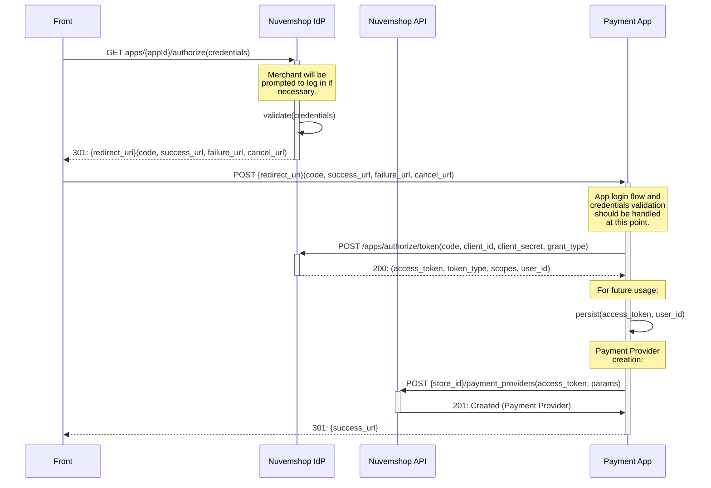

# Payment Provider App Development Guide

## Introduction

This document provides an explanation of what a Payment App is and will guide you through the development process.

In very few words, the steps to develop and deploy an app are:

1. The developer creates a Partner account at Nuvemshop’s Partner’s Portal.
2. The developer creates a Payments App at Nuvemshop’s Partner’s Portal
3. The developer sets up a scalable backend on their own infrastructure where the Nuveshop’s REST APIs will be implemented.
4. The developer Nuvemshop’s REST APIs, including the Payment Provider and Transaction’s resources.
5. The developer implements their frontend scripts according to Nuvemshop’s JS interface specifications, hosts the file in a public CDN and provides a link to the file or files through our APIs.
6. The app is audited by Nuvemshop to test the implementation, scalability, stability, and other important factors.
7.  The app is released by Nuvemshop.

## Step 1: Partner account and App creation

To interact with our APIs, you must create an App. An App represents our partner’s products in our platform. Each App has a set of credentials required to authenticate against our platform and be granted access to our APIs on behalf of the merchant depending on the scopes enabled on the App’s settings.

The steps to create a Payment App are the following:

1.  If your company doesn’t already have a Partner’s Account, it can be created at our [Partner’s Portal](https://partners.nuvemshop.com.br/).
2.  At the Partner’s Portal, create an app and make sure all the fields are completed with valid and real data.
3.  Take special care on the “Redirect URI” which is a key part of the App installation process. You can modify it in the future, if necessary.
4.  You might want to include a good description of your offered payment services, since our platform may bring new clients to your business.
5.  Make sure to choose the “Payments” category.
6.  Since you are creating a Payment App, make sure the App has the following scopes enabled on the Portal:
  - `read_payments`
  - `write_payments`
  - `read_orders`
  - `write_orders`
    

## Step 2: App installation and Payment Provider creation flow

A `Store` can have `n` number of `Payment Providers`. `Stores` have their own `Payment Providers` with their own `id`s and these are unrelated to `Payment Providers` created by the same app on other `Stores`. This means that each time a merchant installs your app, your App must follow the `Payment Provider` creation flow for that App.

`Payment Providers` contain all the configuration to display `payment_methods`, calculate prices, discounts, installments, among others, on the storefront and it also contains properties required for the Checkout process.

The App installation flow is a standard OAuth 2 flow. The details on the App installation flow can be found [here](https://github.com/TiendaNube/api-docs/blob/master/resources/authentication.md) and details on creating a Payment Provider can be found [here](https://github.com/TiendaNube/api-docs/blob/payments-api-docs/resources/payment_provider.md#post-store_idpayment_providers).

During this flow, the App is expected to create the Payment Provider on the merchant’s store.

The following implementation example sequence helps illustrate the process:
- *Front*: The web browser.
- *Nuvemshop IdP*: Nuvemshop’s Identity Provider.
- *Nuvemshop API*: Self described.
- *Payment App*: Any hosts on the Payment Provider’s side.



### Payment Provider Configuration

You can find the list  of Payment Provider object of properties and their description in our API’s Documentation, [here](https://github.com/TiendaNube/api-docs/blob/payments-api-docs/resources/payment_provider.md#payment-provider-1). All of the Payment Provider object properties MUST have valid and real values.

We strongly suggest taking a close look at each of the Payment Provider’s object properties to identify which ones may involve special handling and which ones may depend on the merchant’s account configuration on the Payment Provider’s side. Here's a quick overview of some of the ones we think need extra attention:

#### Checkout Configuration

Most of our APIs are based on REST interfaces. However, our Checkout APIs are based on both, REST and Javascript interfaces. For the Checkout API, the configuration is made through our REST API but the frontend interactions are handled by the JS interface. This allows the app developer to implement their own SDKs on our Checkout's frontend without any intervention from our development teams.

The Payment Provider has two checkout related properties:

- `checkout_options`: List of Payment Options (such a `Transparent`, `Redirect`, `Modal`), and their properties which include some like `name`, `logo_url` and `supported_methods` (`card`, `boleto`, `bank_debit`, `ticket`), among others.

- `checkout_js_url`: The handlers for each `checkout_option` (such as `onLoad`, `onSubmit`, etc) are implemented through the JS API. This property contains a Secure (`HTTPS`) URL pointing to the file with this implementations so our Checkout can run them on the frontend. This URL will be requested from the frontend, which means that the JS file must be hosted on a CDN capable of handling high traffic.

***Note:*** The API docs on the Checkout JS API can be found [here](https://github.com/TiendaNube/api-docs/blob/payments-api-docs/resources/checkout_js.md). Find more details how to implement your SDKs on the checkout JS file on the next section.

#### Storefront Scripts

Note that we frontend has two main components:
- Storefront
- Checkout

In case any frontend Javascript scripts unrelated to the checkout process, like, for example, a fraud prevention script such as a digital footprint, needed to be added to the merchant website’s storefront, our API has a resource for that purpose. Details on how to implement it can be found following [this link](https://github.com/TiendaNube/api-docs/blob/master/resources/script.md).

Any requests to the Scripts Resource API should be sent during the App’s installation process. Your app will need an extra scope to access this resource: `write_scripts`. You must set it at the App's configuration form on the Partner's Portal.

#### Supported Currencies

The content of this field usually depends on settings on the merchant’s App account configuration. It is most important to set valid and real values on this field making sure it reflects the merchants settings to avoid any unexpected behaviour.

Nuvemshop will use this value as a reference to show (allow) or hide (deny) this Payment Provider to buyers based on several business rules. Incorrect supplied values may result in incorrect and/or unsupported transactions being executed.

## Step 3: Implementing the checkout flow

Nuvemshop provides all the necessary REST and JS APIs to allow 3rd Party developers to take care of the whole implementation development in a completely autonomous way. This way, there is no intervention from our development team at all.

To illustrate the “app concept”, let's say we have a `Payment Provider` called “Acme Payments”. Here’s a classic implementation diagram:


And here’s a Nuvemshop App implementation diagram:


### Available Checkout Payment Options

Currently, there are two mainstream Checkout Payment Options. Below are quick descriptions of these to put some context and make sure the reader is aligned with both concepts.

#### Redirect Checkout Payment Option

Pretty much a standard redirect payment flow:

1. The Payment Provider receives information about the order.
2. The buyer is redirected to the Payment Provider’s website.
3. The buyer follows the checkout flow.
  - If the buyer has an account on the Payment Provider and Wallet features are supported, this flow is pretty quick.
4. The buyer is redirected back to the Merchants website and lands on a success, failure or cancel URL.

Some Payment Providers offer SDKs which render a lightbox or modal with an embedded iframe containing the Payment Provider’s checkout UI on the Merchant’s website, giving the buyer a more transparent-like experience.

#### Transparent Checkout Payment Option

This more recent approach keeps the buyer at the Merchant’s website during all the checkout process:

1. The credit or debit card data form is rendered on the Merchant’s Website.
2. The credit or debit card sensible information never goes in a readable way to the Merchants backend.
3. Either from the frontend or from the backend, depending on the strategy (tokenization, encryption, etc), the card information is sent to the Payment Provider, which will be the only backend able to read it.

This option gives the buyer a more store-branded experience which improves the user experience quality.

### Frontend: Checkout Payment Options Implementation (Checkout JS API)

As explained before, the developer is in charge of the frontend and backend implementations. The developer should make a frontend implementation according to our JS APIs specifications. The JS implementation file must be hosted on a CDN that must be able to handle potentially high traffic concurrency with, of course, a secure URL.

[In this link](https://github.com/TiendaNube/api-docs/blob/payments-api-docs/resources/checkout_js.md) you can find very detailed information on how the Checkout JS API is implemented and through a URL as the `checkout_js_url` property of the `Payment Provider` object.

#### Adding a Checkout Payment Option

As explained previously, on the "Checkout Configuration", Checkout Payment Options have two interfaces. The REST interface for parameter configuration, and the JS interface for event handling.

Our front end provides a context through the `LoadCheckoutPaymentContext(...)` global function. This function takes another function as an argument which in turn takes two arguments, the `Checkout` object and `PaymentOption` class family object

Therefore, your Javascript file should look like this:

```javascript
// MyPaymentAppMethodImplementation.js
LoadCheckoutPaymentContext(function(Checkout, Methods) {
  // Your code here
})
```
To add a payment option, the method `Checkout.addPaymentOption(...)` must be called passing an instance of one of the available payment options from the PaymentOptions class family object. The instance must be created by passing an object with the `checkout_option.id` and the event handlers.

```javascript
// MyPaymentAppMethodImplementation.js
LoadCheckoutPaymentContext(function(Checkout, PaymentOptions) {
  // ...
  var AcmeCreditMethod = new PaymentOptions.Transparent.CardPayment({
    id: "...", // REST API `checkout_option.id`
    onLoad: function() {  // This handler is common to all payment options
      // Your code here
    },
    onDataChange: Checkout.utils.throttle(function() {  // This handler is specific of the `Transparent.CardPayment` option.
      // Your code here
    }, 700),
    onSubmit: function() { // This handler is common to all payment options
      // Your code here
    },
    // More handlers...
  })
  Checkout.addPaymentOption(AcmeCreditMethod); // Add the payment method
})
```

**A full description of the available PaymentOptions can be found [here](https://github.com/TiendaNube/api-docs/blob/payments-api-docs/resources/checkout_js.md#methods).**

##### Redirect Method Implementation Example
Let’s assume we’ve created an app called “Acme Payment App” and now we want to implement a Redirect Payment Option, so the user can use their balance or some other method to pay for an order.

First, we’ll start by creating an instance of `PaymentOptions.RedirectPayment` and adding it to the Checkout by using the `Checkout.addPaymentOption(...)` method:

```javascript
// AcmePaymentsRedirectMethod.js
LoadCheckoutPaymentContext(function(Checkout, PaymentOptions) {
  var AcmeRedirectOption = new PaymentOptions.RedirectPayment({
    ...
  })
  Checkout.addPaymentOption(AcmeRedirectOption);
});
```

`PaymentOptions.RedirectPayment` takes an Object as an argument, such a this one:

```javascript
// AcmePaymentsRedirectMethod.js
LoadCheckoutPaymentContext(function(Checkout, PaymentOptions) {

  var AcmeRedirectOption = new PaymentOptions.RedirectPayment({
    // The method’s display name
    id: 'acmepayments_redirect',

    // This function handles the payment submission.
    onSubmit: function(callback) {

      // We gather the minimum needed information.
      let acmeRelevantData = {
        orderId: Checkout.order.cart.id,
        currency: Checkout.order.cart.currency,
        total: Checkout.order.cart.prices.total
      }

      // We use the Checkout http lib to post a request to our server
      // and fetch the redirect_url
      Checkout.http.post('https://app.acmepayments.com/generate-checkout-url', acmeRelevantData)
        .then(function(response) {

          // Once you get the redirect_url, invoke the callback passing it in the
          // object argument
          callback({
            success: true,
            redirect: response.redirect_url
          });
        })
        .catch(function(error) {

          // Handle a potential error in the HTTP request.
          callback({
            success: false
          });
        });
    }
  })
  // Finally, we add the created payment options so it is offered to the buyer.
  Checkout.addPaymentOption(AcmeRedirectOption);
});
```