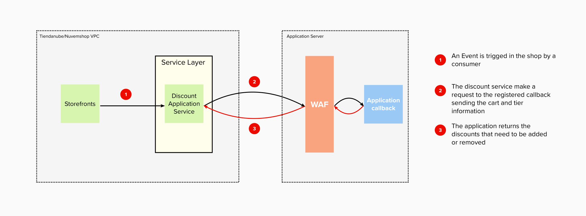

# Discount API: 
<small>Create, manage and apply discount rules.</small>

The Discount API is a set of tools that allows the development of a wide range of promotional rules.

Before we start working, we need to clarify some basic concepts that we will be using from now on.


# Table of Contents

1. [Main Concepts](#main-concepts)
   1. [Promotions and discounts](#promotions-and-discounts)
   2. [Tier](#tier)
2. [How it works](#how-it-works)
3. [Accountabilities](#accountabilities)
4. [Where do I start?](#where-do-i-start)
5. [Integration](#integration)
   1. [Register a callback](#register-a-callback)
   2. [Create promotions](#create-promotions)
   3. [Managing discounts](#managing-discounts)
      1. [Create or Update Discount](#create-or-update-discount) 
      2. [Remove a discount](#remove-a-discount)
         1. [Scope: Line Item](#scope-line-item)
         2. [Scope: Cart](#scope-cart)
      3. [No action needed](#no-action-needed)
      4. [Errors](#command-errors)
         1. [Invalid Response](#invalid-response)
         2. [Invalid Command](#invalid-command)
   4. [Message specifications](#message-specifications)
   5. [Request life cycle](#request-life-cycle)
   6. [Cart life cycle](#cart-life-cycle)
   7. [Uninstalled apps](#uninstalled-apps)
   8. [Security](#security)
6. [Upcoming changes](#upcoming-changes)
7. [Frequently Asked Questions](#frequently-asked-questions)
8. [Resources](#resources)


## Main Concepts<a name="mainconcept"></a> 
### Promotions and discounts<a name="promotions-and-discounts"></a>

A promotion is a set of properties and business rules that can be applied to a user&#39;s cart. An example could be _**3x2 in black t-shirts**_.

This promotion has a name or description, and at the same time, is an expression of business logic which implies that for every three products in the cart, one of these will be free, as long as belongs to a specific set of products. In this case, Black T-shirts.

Even if the promotion describes a business logic, it doesn&#39;t indicate the result of that promotion in a specific cart. In other words, we don&#39;t know how much money will be discounted.

The subtotal of that cart will be 3 x 100 BRL = 300 BRL.

The promotion makes one of these products free, which means a **discount** of 100 BRL on the subtotal. Then, the total of the cart is 200 BRL.

In a nutshell, a discount is a promotion applied to a specific cart.

**PROMOTION** : Set of properties and business rules that describes a behavior.<br/>
**DISCOUNT** : The net value that will be extracted from the cart total because a promotion was applied.

### Tier<a name="tier"></a>

We will call Tier to a specific group of promotions. These tiers will be executed in order and will apply depending on one of each other.

We have three tiers: Line Item, Cross Items and Shipping Line.

**Line Item**: applies at the product level.

**Cross Items**: applies to all products.

**Shipping Line**: applies to shipping costs.


## How it works<a name="how-it-works"></a>

Each application that wants to work with promotions should interact with the Tiendanube/Nuvemshop API to create promotions and 
validate their business rules based on the cart information sent to a specific endpoint on the partner's side.

**Disclaimer**: Currently, the use of multicurrency is not supported. For this reason, its use is not recommended in stores with this feature.

## Accountabilities<a name="accountabilities"></a>

| Accountability | Tiendanube | APP |
| --- | --- | --- |
| To ease the creation and storage of the promotion&#39;s business logic | | **X** |
| Verify that the promotion&#39;s rules comply | | **X** |
| Request a discount to be applied | | **X** |
| Request a discount to be removed | | **X** |
| Add a discount to a cart | **X** | |
| Show the applied discount in the cart | **X** | |

## Where do I start?<a name="where-do-i-start"></a>

Before you start to create your app, you need to follow the points described below:

1. Register as a partner in [{{site.data.institutional.name.ar}}]({{site.data.institutional.partners.ar}}) or [{{ site.data.institutional.name.br }}]({site.data.institutional.partners.br}}).
2. Once inside your partner&#39;s admin panel, go to the &quot;Apps&quot; section and create your app.
3. Read up on [how to authenticate]({{ site.data.links.authentication.main | absolute_url }}) your app with us.
4. Read the API docs to understand what you can do with your app.


## Integration<a name="integration"></a>

### Register a callback<a name="register-a-callback"></a>

The first step to bind an app with a store is to create a callback URL. This URL will be used by Tiendanube/Nuvemshop to 
send all the cart information every time the consumer makes an action on it (Ex: Adds or removes an item, changes the 
quantity of an item, etc.), and the store has promotions.


### Create promotions<a name="create-promotions"></a>


Each application is responsible for the creation and storage of all their business logic. Nevertheless, {{ site.data.institutional.name.mixed }} needs to identify each promotion, which should be doing it through the API.

This operation will return an ID to the combination of the promotions and the current store.

You should take into consideration that some values can&#39;t be updated after the creation. For more information about the API, please refer to [Discount API Docs]({{ site.data.links.discounts.main | absolute_url }}/api).


### Managing discounts<a name="managing-discounts"></a>



Any modification on the cart state will be informed to each of the partners that have  registered a promotion in the store.

Each partner should evaluate the current cart, decide if a promotion should be applied or removed, and respond with the corresponding operations.

These operations in the application responses will receive the name of “commands”. All the commands will have two main properties, the command key, and the command specification.

The command's key defines which operation will be executed, and the specification provides all the data needed to perform it.

The order of command execution is not guaranteed.

The available commands will be the following.

#### Create or Update Discount<a name="create-or-update-discount"></a>

Allows to create or update a discount in a cart.

The operation allows to:

* Add a new discount to one or many line items
* Add a new discount to the cart (cross items)
* Add new line items to an already created discount.
* Update the amount of a specific promotion

Examples:

_Line Item Discount Creation_

```json
{
    "commands": [{	
        "command": "create_or_update_discount",
            "specs": {
                "promotion_id": "c78c3a59-70a9-4d8a-a224-fdd3f925cc72",
                "currency": "ARS",
                "display_text": {
                    "es-ar": "nombre visible de promoción"
                },
                "line_items": [{
                    "line_item": "717394929",
                    "discount_specs": {
                         "type": "fixed",
                          "amount": "250.00"
                    }
                }]
            }
    }]	
}
```

_Cross Items Discount Creation_

```json
{
    "commands": [{	
        "command": "create_or_update_discount",
	"specs": {
                "promotion_id": "449039b3-3c35-4860-8fde-668428ced5f3",
                "currency": "ARS",
                "display_text": {
                    "es-ar": "nombre visible de promoción"
                },
                "discount_specs": {
                    "type": "fixed",
                    "amount": "20.00"	
                }
	}
     }]	
}
```

### Remove a discount<a name="remove-a-discount"></a>
Allows removing an applied discount to a line_item or an entire cart (cross_items) specifying the scope where the operation will affect.

##### Scope: Line Item<a name="scope-line-item"></a>
Allows to remove discounts applied to one or more line_items associated with a single promotion.

```json
{
    "commands": [{	
	"command": "remove_discount",
	"specs": {
                "scope": "line_item",
                "promotion_id": "c78c3a59-70a9-4d8a-a224-fdd3f925cc72",
                "line_items": [
                    "717394929"
                ]
	}
    }]	
}
```

##### Scope: Cart<a name="scope-cart"></a>
Allows removing one or many promotions to the current cart. If the promotion is associated with many line items will be removed from each one.

```json
{
    "commands": [{
        "command": "remove_discount",
        "specs": {
            "scope": "cart",
            "promotion_ids": [ 
                "c78c3a59-70a9-4d8a-a224-fdd3f925cc72" 
            ]
        }
    }]	
}
```

#### No actions needed<a name="no-action-needed"></a>
If no actions are needed, the partner should respond with a 204 HTTP code.

#### Errors<a name="command-errors"></a>
##### Invalid Response<a name="invalid-response"></a>

If the partner’s response doesn’t comply with the specifications, the service will remove ALL the applied discounts from the cart. We are doing this because, given that we don’t know the business logic, we cannot determine if a discount applies or not, and we will try to protect the merchant from money losses instead of getting a new sale.

##### Invalid Command<a name="invalid-command"></a>

If just one command contains invalid specifications, we will consider the response as invalid, therefore, the system will remove ALL the applied discounts from the cart.

### Message specifications<a name="message-specifications"></a>

In each cart update, we will send the following information to the callback URL.

[Cart Payload](./payload/cart.json)

### Request Life Cycle<a name="request-life-cycle"></a>

Each flow starts with a user interaction changing the cart state. For that reason, any request related to a cart that wasn't modified will be rejected by the service.

### Cart Life Cycle<a name="cart-life-cycle"></a>

Some carts are not completed at the moment they were created and could be resumed after a while.

If the cart has applied discounts, but the promotion doesn't exist anymore, or is temporarily deactivated, **it is the responsibility of the partner to remove that promotion**, otherwise, it will still exist on the cart and will cause losses to the merchant.

### Uninstalled apps<a name="uninstalled-apps"></a>
When a promotions app is uninstalled, we will **permanently** remove all the promotions created for that store; In that case, we will stop sending cart update traffic to the partner.

Given this process takes place in the background and asynchronously, some delays could appear. To prevent any misplaced discount, if some cart is sent for a store that uninstalled the app, **a 310 status code MUST be returned**.


### Security<a name="security"></a>

Tiendanube/Nuvemshop will share a list of IP addresses to be registered as a Whitelist in a WFA and each Partner is responsible to block any other connections to their applications.


## Upcoming changes<a name="mainconcept"></a>


### Signed Communication

We will share a secret token with each application to sign each request made by Tiendanube/Nuvemshop on the application callback. Each partner will be responsible for validating that signature.

Once the communication is signed, the WAF will not be necessary anymore, and Tiendanube/Nuvemshop could change their IP without any restriction.


## Frequently Asked Questions<a name="frequently-asked-questions"></a>

### What happens if the server does respond properly?

When Tiendanube/Nuvemshop informs the cart state, each partner should respond as it is expected. If the partner does not respond correctly or have a delay in their response,  given that we can’t determine if a promotion still applies or not, the promotions registered in previous updates will be removed.

### What happens if my discount is no longer valid?

If a promotional rule was valid in the past but is no longer applicable, the discount must be removed through the API by the partner. 


## Resources<a name="resources"></a>

- [Api Specification]({{ site.data.links.discounts.main | absolute_url }}/api)
- [Openapi.yml]({{ site.data.links.discounts.main | absolute_url }}/api/openapi.yml)
