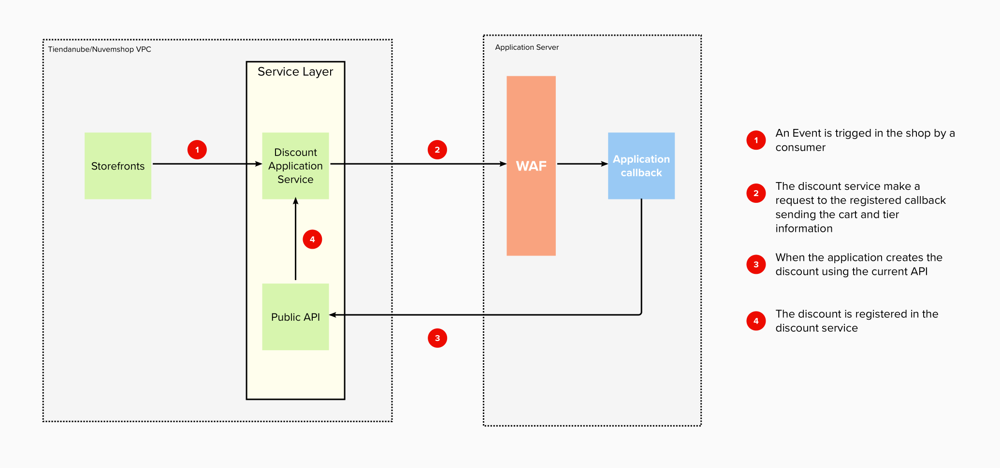

# Discount API: 
<small>Create, manage and apply discount rules.</small>

The Discount API is a set of tools that allows the development of a wide range of promotional rules.

Before we start working, we need to clarify some basic concepts that we will be using from now on.

# Table of Contents

1. [Main Concepts](#main-concepts)
   1. [Promotions and discounts](#promotions-and-discounts)
   2. [Tier](#tier)
2. [How it works](#how-it-works)
3. [Accountabilities](#accountabilities)
4. [Where do I start?](#where-do-i-start)
5. [Integration](#integration)
   1. [Register a callback](#register-a-callback)
   2. [Create promotions](#create-promotions)
   3. [Apply a discount](#apply-a-discount)
   4. [Remove a discount](#remove-a-discount)
   5. [Message specifications](#message-specifications)
   6. [Life Cycle](#life-cycle)
   7. [Security](#security)
6. [Upcoming changes](#upcoming-changes)
7. [Frequently Asked Questions](#frequently-asked-questions)
8. [Resources](#resources)

## Main Concepts 
### Promotions and discounts

A promotion is a set of properties and business rules that can be applied to a user&#39;s cart. An example could be _**3x2 in black t-shirts**_.

This promotion has a name or description, and at the same time, is an expression of business logic which implies that for every three products in the cart, one of these will be free, as long as belongs to a specific set of products. In this case, Black T-shirts.

Even if the promotion describes a business logic, it doesn&#39;t indicate the result of that promotion in a specific cart. In other words, we don&#39;t know how much money will be discounted.

The subtotal of that cart will be 3 x 100 BRL = 300 BRL.

The promotion makes one of these products free, which means a **discount** of 100 BRL on the subtotal. Then, the total of the cart is 200 BRL.

In a nutshell, a discount is a promotion applied to a specific cart.

**PROMOTION** : Set of properties and business rules that describes a behavior. 
**DISCOUNT** : The net value that will be extracted from the cart total because a promotion was applied.

### Tier

We will call Tier to a specific group of promotions. These tiers will be executed in order and will apply depending on one of each other.

We have three tiers: Line Item, Cross Items and Shipping Line.

**Line Item**: applies at the product level.

**Cross Items**: applies to all products.

**Shipping Line**: applies to shipping costs.

## How it works

Each application that wants to work with promotions should interact with the Tiendanube/Nuvemshop API to create promotions and 
validate their business rules based on the cart information sent to a specific endpoint on the partner's side.

## Accountabilities

| Accountability | Tiendanube | APP |
| --- | --- | --- |
| To ease the creation and storage of the promotion&#39;s business logic | | **X** |
| Verify that the promotion&#39;s rules comply | | **X** |
| Request a discount to be applied | | **X** |
| Add a discount to a cart | **X** | |
| Show the applied discount in the cart | **X** | |

## Where do I start?

Before you start to create your app, you need to follow the points described below:

1. Register as a partner in [{{site.data.institutional.name.ar}}]({{site.data.institutional.partners.ar}}) or [{{ site.data.institutional.name.br }}]({site.data.institutional.partners.br}}).
2. Once inside your partner&#39;s admin panel, go to the &quot;Apps&quot; section and create your app.
3. Read up on [how to authenticate]({{ site.data.links.authentication.main | absolute_url }}) your app with us.
4. Read the API docs to understand what you can do with your app.

## Integration

### Register a callback

The first step to bind an app with a store is to create a callback URL. This URL will be used by Tiendanube/Nuvemshop to 
send all the cart information every time the consumer makes an action on it (Ex: Adds or removes an item, changes the 
quantity of an item, etc.), and the store has promotions.

### Create promotions

Each application is responsible for the creation and storage of all their business logic. Nevertheless, {{ site.data.institutional.name.mixed }} needs to identify each promotion, which should be doing it through the API.

This operation will return an ID to the combination of the promotions and the current store.

You should take into consideration that some values can&#39;t be updated after the creation. For more information about the API, please refer to [Discount API Docs]({{ site.data.links.discounts.main | absolute_url }}/api).

### Apply a discount

Any modification on the cart state will be informed to each of the partners that have  registered a promotion in the store.

Each partner should evaluate the current cart and decide if a promotion should be applied (or removed), and make the corresponding request to do this.

For more information about the API requests used to create or remove a discount, please refer to [Discount API Docs]({{ site.data.links.discounts.main | absolute_url }}/api).

### Remove a discount

The same flow applies to discount removal. Once the cart is sent and the discount to remove is identified, the partner’s 
application needs to send a request to delete it.

For more information about the API requests used to create or remove a discount, please refer to [Discount API Docs]({{ site.data.links.discounts.main | absolute_url }}/api).

### Message specifications

In each cart update, we will send the following information to the callback URL.

[Cart Payload](./payload/cart.json)

### Life Cycle

Each flow starts with a user interaction changing the cart state. For that reason, any request related to a cart that wasn't modified will be rejected by the service.

### Security

Tiendanube/Nuvemshop will share a list of IP addresses to be registered as a Whitelist in a WFA and each Partner is responsible to block any other connections to their applications.

## Upcoming changes

### Flow Improvements

The new architecture allows us to reduce the number of operations needed to add or remove a discount. We will change 
the requested response on callback to get that information on the same request instead of additional requests through 
the Public API.

### Signed Communication

We will share a secret token with each application to sign each request made by Tiendanube/Nuvemshop on the application callback. Each partner will be responsible for validating that signature.

Once the communication is signed, the WAF will not be necessary anymore, and Tiendanube/Nuvemshop could change their IP without any restriction.

## Frequently Asked Questions

### What happens if the server does respond properly?

When Tiendanube/Nuvemshop informs the cart state, each partner should respond as it is expected. If the partner does not respond correctly or have a delay in their response,  given that we can’t determine if a promotion still applies or not, the promotions registered in previous updates will be removed.

### What happens if my discount is no longer valid?

If a promotional rule was valid in the past but is no longer applicable, the discount must be removed through the API by the partner. 

## Resources

- [Api Specification]({{ site.data.links.discounts.main | absolute_url }}/api)
- [Openapi.yml]({{ site.data.links.discounts.main | absolute_url }}/api/openapi.yml)
