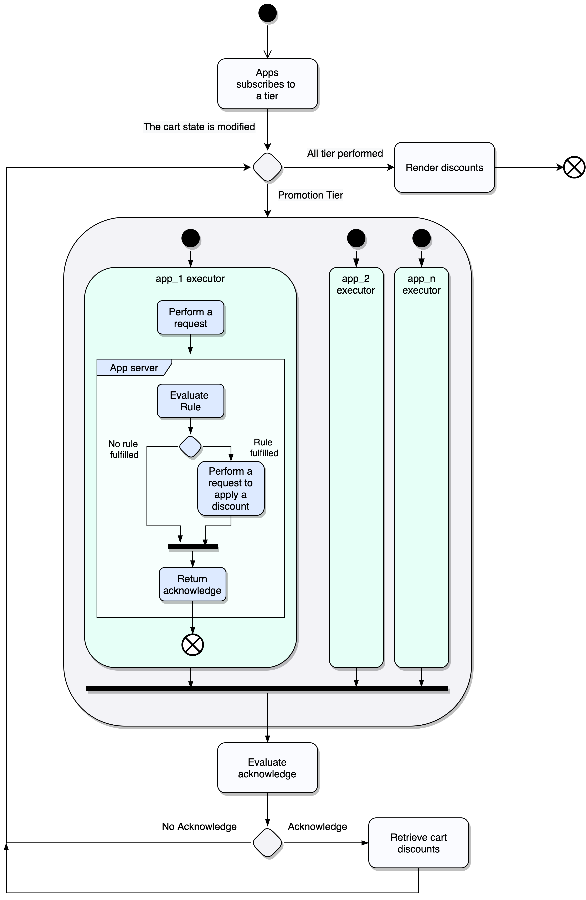

# Discount API: 
<small>Create, manage and apply discount rules.</small>

The Discount API is a set of tools that allows the development of a wide range of promotional rules.

Before we start working, we need to clarify some basic concepts that we will be using from now on.


## Definitions 
### Promotions and discounts

A promotion is a set of properties and business rules that can be applied to a user&#39;s cart. An example could be _**3x2 in black t-shirts**_.

This promotion has a name or description, and at the same time, is an expression of business logic which implies that for every three products in the cart, one of these will be free, as long as belongs to a specific set of products. In this case, Black T-shirts.

Even if the promotion describes a business logic, it doesn&#39;t indicate the result of that promotion in a specific cart. In other words, we don&#39;t know how much money will be discounted.

The subtotal of that cart will be 3 x 100 BRL = 300 BRL.

The promotion makes one of these products free, which means a **discount** of 100 BRL on the subtotal. Then, the total of the cart is 200 BRL.

In a nutshell, a discount is a promotion applied to a specific cart.

**PROMOTION** : Set of properties and business rules that describes a behavior.<br/>
**DISCOUNT** : The net value that will be extracted from the cart total because a promotion was applied.

### Executors

An Executor refers to a function registered by the application to be performed once an event occurs.

### Tier

We will call Tier to a specific group of promotions. These tiers will be executed in order and will apply depending on one of each other.

We have three tiers: Line Item, Cross Item and Shipping Line.


## How it works

Each application that wants to work with promotions, should interact with two main services provided by Tiendanube, the Discount Javascript API, and the Tiendanube API.

The applications can validate their business rules using executors, and these need to be subscribed using the Discount Javascript API to be orchestrated.

On the other side, the Tiendanube API will allow the applications to manage promotions and register discounts through an authenticated REST API.

Likewise, each application must have a way to get the executor&#39;s requests and interact with the Tiendanube API.

## Accountabilities

| Accountability | Tiendanube | APP |
| --- | --- | --- |
| To ease the creation and storage of the promotion&#39;s business logic | | **X** |
| Verify that the promotion&#39;s rules comply | | **X** |
| Request the discount application to a cart | | **X** |
| Provide acknowledgment that a discount was applied | | **X** |
| Add a discount to a cart | **X** | |
| Show the available discount into the cart | **X** | |

## Where do I start?

Before you start to create your app, you need to follow the points described below:

1. Register as a partner in [{{site.data.institutional.name.ar}}]({{site.data.institutional.partners.ar}}) or [{{ site.data.institutional.name.br }}]({site.data.institutional.partners.br}}).
2. Once inside your partner&#39;s admin panel, go to the &quot;Apps&quot; section and create your app.
3. Read up on [how to authenticate]({{ site.data.links.authentication.main | absolute_url }}) your app with us.
4. Read the API docs to understand what you can do with your app.


## Integration

### Create promotions


Each application is responsible for the creation and storage of all their business logic. Nevertheless, {{ site.data.institutional.name.mixed }} needs to identify each promotion, which should be doing it through the API.

This operation will return an ID to the combination of the promotions and the current store.

You should take into consideration some values can&#39;t be updated after the creation. For more information about the API, please refer to [Discount API Docs]({{ site.data.links.discounts.main | absolute_url }}/api).

### Apply a discount


Any modification on the cart state will be evaluated and informed to each partner which is registered to a promotion tier through the Discount Application JS API.

Each partner should evaluate the current cart and decide if a promotion should be applied (or removed), and do the corresponding request to do this.

For more information about the API requests used to create or remove a discount, please refer to [Discount API Docs]({{ site.data.links.discounts.main | absolute_url }}/api).

## Front-End Integration

Inside the execution context, in the global scope, the application will have available an instance of the discountService. This can be used to subscribe to executors. Through this, Tiendanube will be capable of orchestrating all the application executors for each available event.

### Subscribing Executors

Different events are available to listen up and take actions based on it, and even though a custom listener can be used, in this context, the method **discountService.subscribe(fn)** should be used.

Fn is representing an async function. This one is responsible for the execution of any needed logic to evaluate the business rules.

```javascript

const tierName = tierNameProvider.get('LINE_ITEM'),

discountService.suscribe(tierName, async (data) => {
   return await fetch('https://rules.my-discount-app.com', {
      method: 'POST',
      body: JSON.stringify(event.detail)
   })
   .then(response => response.json());
});

```


This example presents some points to consider.

- The tier name is retrieved using the global instance of **tierNameProvider**.
- The executor will get the information needed as a data object as a parameter.
- The body MUST contain the property **acknowledge,** which will be used to determine if partner does some modification to the cart (add or remove a discount)

### Data Objects

At the time that the executor is called, a data object will be sent as a parameter. This object will contain the information of the current cart.

For more information about the structures please refers [here]({{ site.data.links.discounts.main | absolute_url}}/data-objects)


## Discount application flow




## Resources

- [Api Specification]({{ site.data.links.discounts.main | absolute_url }}/api)
- [Openapi.yml]({{ site.data.links.discounts.main | absolute_url }}/api/openapi.yml)

## Frequently Asked Questions

### What should my executor return?

Once the executor was performed, the discountService will evaluate the property **acknowledge**. This property informs that the application made a successful Intent and the result should be verified.

### What happens if my discount is no longer valid?

If a promotional rule was valid in the past but is no longer applicable, the discount must be removed through the API by the partner.
