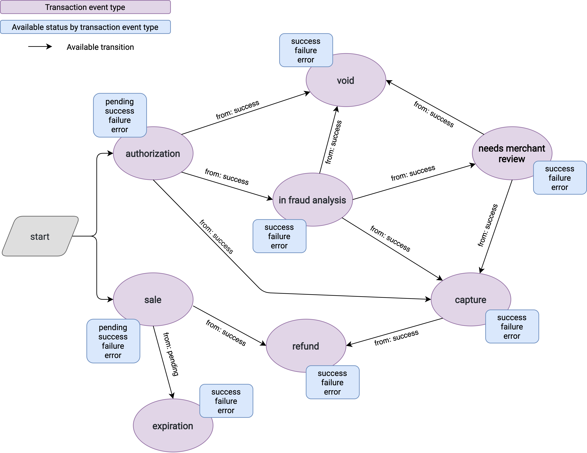
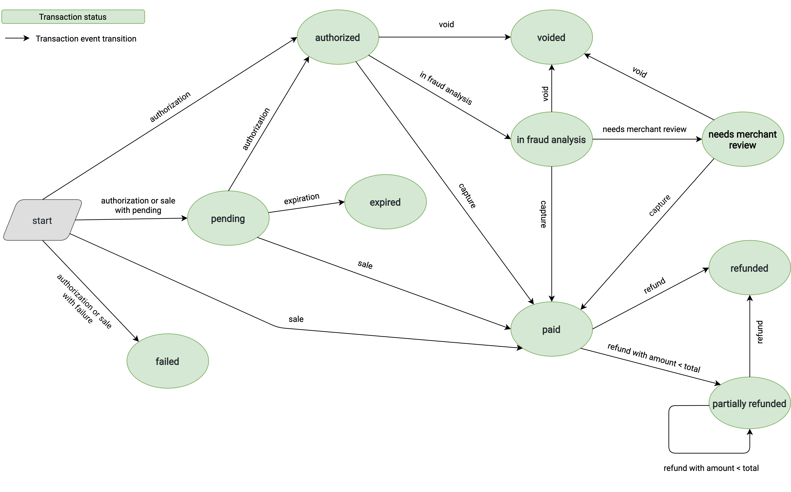

Transaction
===========

Each movement of money is modeled through a `Transaction` object, which can be of different types (e.g. credit card, debit card, boleto, wire transfer, etc.). Each `Transaction` type has a Finite State Machine (FSM) that defines its current status. The `Transaction Event` object represents transitions in the `Transaction`'s FSM.

A [Payment Provider](payment_provider.md) can create a Transaction and update its status through Transaction Events as it changes over time. Since an order can be related to multiple payment methods, a different Transaction must be created for each of them using the same order ID.

Properties
---------

All `Transaction` types have the same attributes, but may generate different kinds of  *events* and contain some *info* fields specific to their type.

| Field                 | Type          | Description                                                  |
| :-------------------- | :------------ | :----------------------------------------------------------- |
| `id`                  | String        | [Read-only] Unique identifier of the Transaction object.     |
| `payment_provider_id` | String        | ID of the [Payment Provider](payment_provider.md) that processed this Transaction. |
| `payment_method`      | Object        | Object containing the payment method used in this Transaction. See [Payment Method](#Payment-Method). |
| `info`                | Object        | Object containing specific info related to this Transaction. See [Transaction Info](#Transaction-Info). |
| `status`              | Object        | [Read-only] The state of the FSM in which the Transaction is. See [Transaction Status](#Transaction-Status). |
| `events`              | Array(Object) | [Read-only] List of fulfillment events related to this Transaction. See [Transaction Events](#Transaction-Events). |
| `captured_amount`     | Object        | [Read-only] Object containing the captured amount of this Transaction. See [Money](#Money). |
| `refunded_amount`     | Object        | [Read-only] Object containing the refunded amount of this Transaction. See [Money](#Money). |
| `authorized_amount`   | Object        | [Read-only] Object containing the authorized amount of this Transaction. See [Money](#Money). |
| `voided_amount`       | Object        | [Read-only] Object containing the voided amount of this Transaction. See [Money](#Money). |
| `failure_code`        | String        | [Read-only] If the transaction failed, this field is used to indicate the code related to the failure cause. See [Transaction Failure Codes](#Transaction-Failure-Codes). |
| `created_at`          | Date          | [Read-only] ISO 8601 date for the date the Transaction was created in our platform. Defaults to current time. E.g. `"2020-03-11T12:42:15.000Z"`. |

> ***Note:*** Read-only properties will only appear in our responses, which means that should not be part of the requests.

### Payment Method

| Field  | Type   | Description                                                  |
| ------ | ------ | ------------------------------------------------------------ |
| `type` | String | One of the available [Payment Method Types](payment_provider.md#Payment-Method-Types). |
| `id`   | String | [Optional for `cash`, `pix` and `wallet`] ID of the payment method used for this Transaction. See [Supported Payment Methods by Payment Method Type](payment_provider.md#Supported-Payment-Methods-by-Payment-Method-Type). |

### Transaction Info

This object is used to indicate specific information of a Transaction. It can be omitted in the Transaction body if all its fields are unfilled.

| Field                          | Type   | Description                                                  |
| ------------------------------ | ------ | ------------------------------------------------------------ |
| `card`                         | Object | [Optional] Object containing data related to the consumer's credit or debit card. See [Card Info](#Card-Info). |
| `installments`                 | Object | [Required for `credit_card`] Object containing the installments data related to this Transaction. See [Installments Info](#Installments-Info). |
| `integration_type`             | String | One of the available [Transaction Integration Types](#Transaction-Integration-Types). |
| `external_id`                  | String | [Optional] ID used by the Payment Provider.                  |
| `external_url`                 | String | [Optional] HTTPS URL with details of this Transaction for the merchant. |
| `external_resource_url`        | String | [Required for transparent transactions with `boleto`, `ticket`, `wire_transfer`, `bank_debit` and `pix`] HTTPS URL of the boleto or ticket to show to the consumer to resume the payment. In the case of bank debit and wire transfer, link to the bank selected by the consumer to make the transaction. In the case of PIX, source to the QR code image to show to the consumer to make the payment, it could be a URL or a `base64` code. |
| `external_resource_code`       | String | [Required for transparent transactions with `boleto`, `ticket`, `wire_transfer`, `bank_debit` and `pix`] Barcode for boleto, or code for ticket. For all other cases, used as a reference code for the consumer. |
| `external_resource_expires_at` | Date   | [Required for transparent transactions with `boleto`, `ticket` and `pix`] ISO 8601 date for the expiration date of a boleto or ticket. |
| `refund_url`                   | String | [Optional] HTTPS URL for refunding this transaction. See [Refund URL](#Refund-URL). |
| `ip`                           | String | [Optional] IP of the device that initiated this Transaction. |

> ***Note:*** All URLs must be secure URLs (https).

### Card Info

| Field              | Type   | Description                                                  |
| ------------------ | ------ | ------------------------------------------------------------ |
| `brand`            | String | The brand of the card. See [Supported Card Brands](payment_provider.md#Supported-Payment-Methods-by-Payment-Method-Type). |
| `issuer`           | String | [Optional] The issuer of the card.                           |
| `expiration_month` | Number | The expiration month of the card.                            |
| `expiration_year`  | Number | The expiration year of the card.                             |
| `first_digits`     | String | The first 6 (six) digits of the card.                        |
| `last_digits`      | String | The last 4 (four) digits of the card.                        |
| `masked_number`    | String | [Optional] Masked card number displaying only the last 4 (four) digits. E.g. `"XXXXXXXXXXXX1234"`. |
| `name`             | String | Name of the card holder.                                     |

### Installments Info

| Field      | Type   | Description                                               |
| ---------- | ------ | --------------------------------------------------------- |
| `quantity` | Number | The number of installments. E.g. `3`.                     |
| `interest` | String | The interest applied to each installment. E.g. `"0.015"`. |

### Refund URL

This is the URL a Payment App should specify when creating a transaction that supports refunding.
When Tiendanube sends a POST request to the refund URL, the Payment App should expect to receive the following JSON payload:

| Field      | Type   | Description                                               |
| ---------- | ------ | --------------------------------------------------------- |
| `store_id` | String | The store ID.
| `payment_provider_id` | String | The [Payment Provider](payment_provider.md) ID. |
| `transaction_id` | String | The [Transaction](#Properties) ID. |
| `amount` | Object | [Optional] The money to be refunded. See [Money](#Money). |

The Payment App must response Tiendanube the HTTP status code `202`. This status code indicates the Payment App accepts the refund request and eventually will refund the money. This is because refunding a transaction might be an async process and its complexity is different for each Payment App.
It is very important to point out that once a refund process is done by a Payment App, it must be notified to Tiendanube through a [Transaction Event](#Transaction-Events) of type `refund`.

#### POST https://some-payment-app.com/refund

Requesting a Payment App for its `approved/captured` transaction to be refunded.

<details>
  <summary><b>Request</b></summary>

```
{
"store_id": "12345",
"payment_provider_id": "6b7727b1-f912-4dcf-b0ae-0d006122598f",
"transaction_id": "6e760b6e-e4f3-42ba-8a2d-afddf44e6cf1",
"amount" : {
    "value": "200.45",
    "currency": "BRL"
  }
}
```

</details>

<details>
  <summary><b>Response</b></summary>

`HTTP/1.1 202 OK`

</details>

> ***Note:*** The URL `some-payment-app.com/refund` is used as an example. Replace it with your own domain and path.

> ***Note:*** The refund URL must have no path variables.

> ***Note:*** If the `amount` property is not specified, then the Payment App must refund the total amount for the transaction.

### Transaction Events

| Field            | Type   | Description                                                  |
| ---------------- | ------ | ------------------------------------------------------------ |
| `id`             | String | [Read-only] Unique identifier of the Transaction Event object. |
| `transaction_id` | String | [Read-only] ID of the [Transaction](#Transaction) related to this Transaction Event. |
| `amount`         | Object | Object containing the amount of this Transaction Event. See [Money](#Money). <br/><br/>*Note:* For this value, only the cart total price reported by Tiendanube should be considered (See [Cart Data](checkout.md#data)). Extra payment method costs such as credit card interest should be excluded from the Transaction amount and can optionally be included into the [Card Info](#Card-Info) object. If multiple payments for the same order are allowed by the payment provider, then the sum of the amount of the generated transactions should be equal to the cart total price, disregarding costs associated with the payment provider. *Not doing this could cause some fraud scenarios*. |
| `type`           | String | One of the available [Transaction Event Types](#Transaction-Event-Types). |
| `status`         | Object | One of the available [Transaction Event Status](#Transaction-Event-Status). |
| `info`           | Object | Object containing specific info related to this Transaction Event. See [Transaction Event Info](#Transaction-Event-Info). |
| `failure_code`   | String | [Required for Transaction Event Status `failure`] If the Transaction Event failed, this field is used to indicate the code related to the failure cause. See [Transaction Failure Codes](#Transaction-Failure-Codes). |
| `happened_at`    | Date   | ISO 8601 date for the date the Transaction Event was processed. Defaults to current time. E.g. `"2020-03-11T12:42:15.000Z"`. |
| `expires_at`     | Date   | [Optional] ISO 8601 date for date the Transaction Event expires. It will be used to indicate to the merchant the deadline to accept or cancel a transaction under review. |
| `created_at`     | Date   | [Read-only] ISO 8601 date for the date the Transaction Event was created in our platform. Defaults to current time. E.g. `"2020-03-11T12:42:15.000Z"`. |

> ***Note:*** The `amount` property is required for `authorization` and `sale` Transaction Event Types, and must always be included in the `first_event` field during the Transaction creation. If no `amount` value is specified for subsequent events  `void`, `refund` or `capture`, the total amount indicated in the first event is assumed.

### Money

| Field      | Type   | Description                                                 |
| ---------- | ------ | ----------------------------------------------------------- |
| `value`    | String | Amount of money as a string. E.g. `"49.99"`                 |
| `currency` | String | ISO 4217 code for the currency, such as ARS, BRL, USD, etc. |

> ***Note:*** Decimal numbers are represented as string format for better decimal precision handling. It must contain two decimal places and use a point as decimal separator.

### Transaction Status

Each type of Transaction has a Finite State Machine (FSM) that defines its status:

* `authorized`: The transaction is authorized.
* `expired`: The transaction is expired.
* `failed`: The transaction failed.
* `in_fraud_analysis`: The transaction is under fraud analysis by the payment provider.
* `needs_merchant_review`: The transaction needs merchant action to continue.
* `paid`: The transaction is confirmed.
* `partially_refunded`: The transaction is partially refunded.
* `pending`: The transaction is pending.
* `refunded`: The transaction is refunded.
* `voided`: The transaction is voided.

### Transaction Integration Types

* `external`: Payment was processed on the payment provider's site.
* `modal`: Payment was processed opening a modal to the payment provider's site.
* `transparent`: Payment was processed directly on the merchant's checkout.

### Transaction Event Types

* `authorization`: The credit card transaction has been authorized.
* `capture`: The credit card transaction has been captured.
* `expiration`: The transaction has expired.
* `in_fraud_analysis`: The credit card transaction is being reviewed by the payment provider (no merchant action is required).
* `refund`: The sale has been fully refunded.
* `needs_merchant_review`: The credit card transaction has to be approved or rejected by the merchant.
* `sale`: Represents an authorization along with capture for credit card transactions, or a sale event for all other payment method types.
* `void`: The credit card transaction has been voided.

### Transaction Event Status

* `error`: There was an error processing the transaction event.
* `failure`: The transaction event failed. See [this list](#Transaction-Failure-Codes) for possible failure causes.
* `pending`: The transaction event is pending.
* `success`: The transaction event succeded.

### Transaction Event Info

| Field         | Type   | Description                                                  |
| ------------- | ------ | ------------------------------------------------------------ |
| `message`     | String | [Optional] Description to explain a Transaction Event update. |
| `fraud_score` | String | [Optional] Decimal score between 0 to 1. The closer the score is to 1, the more likely the Transaction is fraudulent. E.g `"0.15"`. |
| `risk_level`  | String | [Optional] Risk level that an Order is fraudulent. One of `low`, `medium` or `high`. |
| `accept_url`  | String | [Optional] HTTPS URL we will call to accept the Transaction from our platform. It should return a 2xx HTTP code or we will return an error to the merchant. |
| `cancel_url`  | String | [Optional] HTTPS URL we will call to cancel the Transaction from our platform. It should return a 2xx HTTP code or we will return an error to the merchant. |

### Transaction Event Workflow

Transaction Events are used to alter the status of a Transaction and to provide related information to take action on it.

There are specific *status* values and transitions for each Transaction Event Type, which are shown in the following diagram.

> The green boxes contains the list of *status* values that each Transaction Event Type supports.



#### Available Transaction Event Types by Payment Method Type

The following table shows the Transaction Event Types supported for each *payment method type*.

| Payment Method Type                                          | Transaction Event Type                                       |
| ------------------------------------------------------------ | ------------------------------------------------------------ |
| `credit_card`                                                | `sale`, `authorization`, `capture`, `in_fraud_analysis`, `needs_merchant_review`, `void`, `refund` |
| `boleto`, `pix`, `ticket`                                    | `sale`, `expiration`, `refund`                               |
| `bank_debit`, `cash`, `debit_card`, `wallet`, `wire_transfer` | `sale`, `refund`                                             |

### Transaction Status Workflow

A Transaction may change its *status* upon receiving a Transaction Event. The following diagram shows the possible Transaction Status transitions based on the events the Transaction receives.

> The arrows represent the occurrence of a Transaction Event with *status* `success` unless another status is mentioned in its description.




Endpoints
---------

### POST /orders/{*order_id*}/transactions

Create a Transaction for a given order.

<details>
  <summary><b>Request</b></summary>


| Field                 | Type   | Description                                                  |
| :-------------------- | :----- | :----------------------------------------------------------- |
| `payment_provider_id` | String | [Required] ID of the [Payment Provider](https://github.com/TiendaNube/api-docs/blob/payments-api-docs/resources/payment_provider.md) that processed this Transaction. |
| `payment_method`      | Object | [Required] Object containing the payment method used in this Transaction. See [Payment Method](#Payment-Method). |
| `first_event`         | Object | [Required] First transaction event that generated this Transaction. See [Transaction Events](#Transaction-Events). |
| `info`                | Object | [Optional] Object containing specific info related to this Transaction. See [Transaction Info](#Transaction-Info). |

</details>

<details>
  <summary><b>Response</b></summary>


`HTTP/1.1 201 Created`

The created [Transaction Object](#Transaction) is returned.

</details>

### POST /orders/{*order_id*}/transactions/{*transaction_id*}/events

Create a Transaction Event for a given Transaction.

<details>
  <summary><b>Request</b></summary>


| Field          | Type   | Description                                                  |
| -------------- | ------ | ------------------------------------------------------------ |
| `type`         | String | [Required] One of the available [Transaction Event Types](#Transaction-Event-Types). |
| `status`       | Object | [Required] One of the available [Transaction Event Status](#Transaction-Event-Status). |
| `happened_at`  | Date   | [Required] ISO 8601 date for the date the Transaction Event was processed. Defaults to current time. E.g. `"2020-03-11T12:42:15.456Z"`. |
| `amount`       | Object | [Optional] Object containing the amount of this Transaction Event. See [Money](#Money). |
| `info`         | Object | [Optional] Object containing specific info related to this Transaction Event. See [Transaction Event Info](#Transaction-Event-Info). |
| `failure_code` | String | [Optional] If the Transaction Event failed, this field is used to indicate the code related to the failure cause. See [Transaction Failure Codes](#Transaction-Failure-Codes). |

</details>

<details>
  <summary><b>Response</b></summary>


`HTTP/1.1 201 Created`

The created [Transaction Event Object](#Transaction-Events) is returned.

</details>

### GET /orders/{*order_id*}/transactions

Get all Transactions for a given order.

<details>
  <summary><b>Request</b></summary>


```
{}
```

</details>

<details>
  <summary><b>Response</b></summary>


`HTTP/1.1 200 OK`

Array of [Transaction Objects](#Transaction)

</details>

### GET /orders/{*order_id*}/transactions/{*transaction_id*}

Get a specific Transaction for a given order.

<details>
  <summary><b>Request</b></summary>


```
{}
```

</details>

<details>
  <summary><b>Response</b></summary>


`HTTP/1.1 200 OK`

[Transaction Object](#Transaction)

</details>

## HTTP Errors List

* **400 Bad Request** - the request could not be understood or was missing required parameters.
* **401 Unauthorized** - authentication failed or user doesn't have permissions for requested operation.
* **403 Forbidden** - access denied.
* **404 Not Found** - resource was not found.
* **405 Method Not Allowed** - requested method is not supported for resource.

## Common Examples

<details>
  <summary><b>Example Nº 1: Create a credit card transaction that is authorized and captured within a single event</b></summary>


#### POST /orders/12345/transactions

##### Request

```json
{
  "payment_provider_id": "eeac118e-5534-40ba-b539-443449bc67a3",
  "payment_method": {
    "type": "credit_card",
    "id": "visa"
  },
  "info": {
    "card": {
      "brand": "visa",
      "expiration_month": 12,
      "expiration_year": 2020,
      "first_digits": "445566",
      "last_digits": "1234",
      "masked_number": "XXXXXXXXXXXX1234",
      "name": "Ash Ketchum"
    },
    "installments": {
      "quantity": 3,
      "interest": "0.15"
    },
    "external_id": "1234",
    "external_url": "https://mypayments.com/account/transactions/1234",
    "refund_url": "https://mypayments.com/refund",
    "ip": "192.168.0.25"
  },
  "first_event": {
    "amount": {
      "value": "132.95",
      "currency": "ARS"
    },
    "type": "sale",
    "status": "success",
    "happened_at": "2020-01-25T12:30:15.000Z"
  }
}
```

##### Response

`201 Created`

```json
{
  "id": "aee7e83e-9537-4baf-a4ea-20e6b38521c7",
  "payment_provider_id": "eeac118e-5534-40ba-b539-443449bc67a3",
  "captured_amount": {
    "value": "132.95",
    "currency": "ARS"
  },
  "refunded_amount": {
    "value": "0.00",
    "currency": "ARS"
  },
  "authorized_amount": null,
  "voided_amount": null,
  "payment_method": {
    "type": "credit_card",
    "id": "visa"
  },
  "status": "paid",
  "info": {
    "card": {
      "brand": "visa",
      "expiration_month": 12,
      "expiration_year": 2020,
      "first_digits": "445566",
      "last_digits": "1234",
      "masked_number": "XXXXXXXXXXXX1234",
      "name": "Ash Ketchum"
    },
    "installments": {
      "quantity": 3,
      "interest": "0.1500"
    },
    "external_id": "1234",
    "external_url": "https://mypayments.com/account/transactions/1234",
    "refund_url": "https://mypayments.com/refund",
    "ip": "192.168.0.25"
  },
  "failure_code": null,
  "created_at": "2020-07-25 17:26:23",
  "events": [
    {
      "transaction_id": "aee7e83e-9537-4baf-a4ea-20e6b38521c7",
      "amount": {
        "value": "132.95",
        "currency": "ARS"
      },
      "type": "sale",
      "status": "success",
      "failure_code": null,
      "created_at": "2020-07-25T20:26:23.323Z",
      "happened_at": "2020-01-25T12:30:15Z",
      "expires_at": null
    }
  ]
}
```

</details>

<details>
  <summary><b>Example Nº 2: Create a boleto transaction that starts pending and then is paid by the buyer</b></summary>


#### POST /orders/56789/transactions

##### Request

```json
{
  "payment_provider_id": "eeac118e-5534-40ba-b539-443449bc67a3",
  "payment_method": {
    "type": "boleto",
    "id": "bradesco"
  },
  "info": {
    "external_id": "1234",
    "external_url": "https://mypayments.com/account/transactions/1234",
    "external_resource_url": "https://mypayments.com/boleto/1234",
    "external_resource_code": "00190500954014481606906809350314337370000000100",
    "external_resource_expires_at": "2020-02-05T12:30:15.000Z",
    "ip": "192.168.0.25"
  },
  "first_event": {
    "amount": {
      "value": "132.95",
      "currency": "ARS"
    },
    "type": "sale",
    "status": "pending",
    "happened_at": "2020-01-25T12:30:15.000Z"
  }
}
```

##### Response

`201 Created`

```json
{
  "id": "6b765950-e8e2-49f1-9c6a-0bb7c15a4f41",
  "payment_provider_id": "eeac118e-5534-40ba-b539-443449bc67a3",
  "captured_amount": {
    "value": "0.00",
    "currency": "ARS"
  },
  "refunded_amount": {
    "value": "0.00",
    "currency": "ARS"
  },
  "authorized_amount": null,
  "voided_amount": null,
  "payment_method": {
    "type": "boleto",
    "id": "bradesco"
  },
  "status": "pending",
  "info": {
    "external_resource_url": "https://mypayments.com/boleto/1234",
    "external_resource_code": "00190500954014481606906809350314337370000000100",
    "external_resource_expires_at": "2020-02-05T12:30:15Z",
    "external_id": "1234",
    "external_url": "https://mypayments.com/account/transactions/1234",
    "ip": "192.168.0.25"
  },
  "failure_code": null,
  "created_at": "2020-07-25 17:27:42",
  "events": [
    {
      "transaction_id": "6b765950-e8e2-49f1-9c6a-0bb7c15a4f41",
      "amount": {
        "value": "132.95",
        "currency": "ARS"
      },
      "type": "sale",
      "status": "pending",
      "failure_code": null,
      "created_at": "2020-07-25T20:27:42.784Z",
      "happened_at": "2020-01-25T12:30:15Z",
      "expires_at": null
    }
  ]
}
```

#### POST /orders/56789/transactions/6b765950-e8e2-49f1-9c6a-0bb7c15a4f41/events

##### Request

```json
{
  "type": "sale",
  "status": "success",
  "happened_at": "2020-01-27T12:30:15.000Z"
}
```

##### Response

`201 Created`

```json
{
  "transaction_id": "6b765950-e8e2-49f1-9c6a-0bb7c15a4f41",
  "amount": {
    "value": "132.95",
    "currency": "ARS"
  },
  "type": "sale",
  "status": "success",
  "failure_code": null,
  "created_at": "2020-07-25T20:28:26.590Z",
  "happened_at": "2020-01-27T12:30:15Z",
  "expires_at": null
}
```

</details>

<details>
  <summary><b>Example Nº 3: Get a credit card transaction that has been authorized, captured and then refunded</b></summary>


#### GET /orders/56789/transactions/21781944-a977-4b0d-93dc-908ddb87d778

##### Request

```
{}
```

##### Response

`201 OK`

```json
{
  "id": "21781944-a977-4b0d-93dc-908ddb87d778",
  "payment_provider_id": "eeac118e-5534-40ba-b539-443449bc67a3",
  "captured_amount": {
    "value": "132.95",
    "currency": "ARS"
  },
  "refunded_amount": {
    "value": "132.95",
    "currency": "ARS"
  },
  "authorized_amount": {
    "value": "132.95",
    "currency": "ARS"
  },
  "voided_amount": null,
  "payment_method": {
    "type": "credit_card",
    "id": "visa"
  },
  "status": "refunded",
  "info": {
    "card": {
      "brand": "visa",
      "expiration_month": 12,
      "expiration_year": 2020,
      "first_digits": "445566",
      "last_digits": "1234",
      "masked_number": "XXXXXXXXXXXX1234",
      "name": "Ash Ketchum"
    },
    "installments": {
      "quantity": 3,
      "interest": "0.1500"
    },
    "external_id": "1234",
    "external_url": "https://mypayments.com/account/transactions/1234",
    "refund_url": "https://mypayments.com/refund",
    "ip": "192.168.0.25"
  },
  "failure_code": null,
  "created_at": "2020-07-25 17:30:15",
  "events": [
    {
      "transaction_id": "21781944-a977-4b0d-93dc-908ddb87d778",
      "amount": {
        "value": "132.95",
        "currency": "ARS"
      },
      "type": "authorization",
      "status": "success",
      "failure_code": null,
      "created_at": "2020-07-25T20:30:15.138Z",
      "happened_at": "2020-01-25T12:30:15Z",
      "expires_at": null
    },
    {
      "transaction_id": "21781944-a977-4b0d-93dc-908ddb87d778",
      "amount": {
        "value": "132.95",
        "currency": "ARS"
      },
      "type": "capture",
      "status": "success",
      "failure_code": null,
      "created_at": "2020-07-25T20:30:25.481Z",
      "happened_at": "2020-01-27T12:30:15Z",
      "expires_at": null
    },
    {
      "transaction_id": "21781944-a977-4b0d-93dc-908ddb87d778",
      "amount": {
        "value": "132.95",
        "currency": "ARS"
      },
      "type": "refund",
      "status": "success",
      "failure_code": null,
      "created_at": "2020-07-25T20:30:33.517Z",
      "happened_at": "2020-01-27T12:30:15Z",
      "expires_at": null
    }
  ]
}
```

</details>

<details>
  <summary><b>Example Nº 4: Create a confirmed wallet transaction</b></summary>


#### POST /orders/24680/transactions

##### Request

```json
{
  "payment_provider_id": "eeac118e-5534-40ba-b539-443449bc67a3",
  "payment_method": {
    "type": "wallet"
  },
  "info": {
    "external_id": "1234",
    "external_url": "https://mypayments.com/account/transactions/1234"
  },
  "first_event": {
    "amount": {
      "value": "100.00",
      "currency": "BRL"
    },
    "type": "sale",
    "status": "success",
    "happened_at": "2020-01-25T12:30:15.000Z"
  }
}
```

##### Response

`201 Created`

```json
{
    "id": "364df14b-2433-4c7d-a4f6-60a512451592",
    "payment_provider_id": "eeac118e-5534-40ba-b539-443449bc67a3",
    "captured_amount": {
        "value": "100.00",
        "currency": "BRL"
    },
    "refunded_amount": {
        "value": "0.00",
        "currency": "BRL"
    },
    "authorized_amount": null,
    "voided_amount": null,
    "payment_method": {
        "type": "wallet",
        "id": "wallet"
    },
    "status": "paid",
    "info": {
        "external_id": "1234",
        "external_url": "https://mypayments.com/account/transactions/1234"
    },
    "failure_code": null,
    "created_at": "2020-09-04 14:27:30",
    "events": [
        {
            "transaction_id": "364df14b-2433-4c7d-a4f6-60a512451592",
            "amount": {
                "value": "100.00",
                "currency": "BRL"
            },
            "type": "sale",
            "status": "success",
            "failure_code": null,
            "created_at": "2020-09-04T17:27:30.584Z",
            "happened_at": "2020-01-25T12:30:15Z",
            "expires_at": null
        }
    ]
}
```

</details>

<details>
  <summary><b>Example Nº 5: Create a failed debit card transaction</b></summary>


#### POST /orders/24680/transactions

##### Request

```json
{
  "payment_provider_id": "eeac118e-5534-40ba-b539-443449bc67a3",
  "payment_method": {
    "type": "debit_card",
    "id": "visa_debit"
  },
  "info": {
    "external_id": "1234",
    "external_url": "https://mypayments.com/account/transactions/1234"
  },
  "first_event": {
    "amount": {
      "value": "132.95",
      "currency": "BRL"
    },
    "type": "sale",
    "status": "failure",
    "failure_code": "card_cvv_invalid",
    "happened_at": "2021-04-22T12:30:15.000Z"
  }
}
```

##### Response

`201 Created`

```json
{
   "id":"96d9256b-6935-41bd-b820-48a33595de1d",
   "payment_provider_id":"eeac118e-5534-40ba-b539-443449bc67a3",
   "captured_amount":null,
   "refunded_amount":null,
   "authorized_amount":null,
   "voided_amount":null,
   "payment_method":{
      "type":"debit_card",
      "id": "visa_debit"
   },
   "status":"failed",
   "info":{
      "refund_url":null,
     "external_id": "1234",
     "external_url": "https://mypayments.com/account/transactions/1234",
      "ip":null
   },
   "failure_code":"card_cvv_invalid",
   "created_at":"2021-04-22 14:56:00",
   "events":[
      {
         "transaction_id":"96d9256b-6935-41bd-b820-48a33595de1d",
         "type":"sale",
         "status":"failure",
         "failure_code":"card_cvv_invalid",
         "created_at":"2021-04-22T14:56:00.910Z",
         "happened_at":"2021-04-22T12:30:15Z",
         "expires_at":null,
         "amount":{
           "value": "132.95",
           "currency": "BRL"
         }
      }
   ]
}
```

</details>

## Appendix

### Transaction Failure Codes

The following list contains all the Transaction failures codes currently supported by our platform, organized by data groups.

<details>
  <summary><b>Consumer</b></summary>


| Failure Code                     | Description                                                  |
| -------------------------------- | ------------------------------------------------------------ |
| `consumer_blocked`               | The consumer is blocked by the payment provider.             |
| `consumer_city_invalid`          | The consumer city is invalid.                                |
| `consumer_country_invalid`       | The consumer country is invalid.                             |
| `consumer_district_invalid`      | The consumer district is invalid.                            |
| `consumer_email_invalid`         | The consumer email is invalid.                               |
| `consumer_firstname_invalid`     | The consumer firstname is invalid.                           |
| `consumer_floor_invalid`         | The consumer address floor is invalid.                       |
| `consumer_id_invalid`            | The consumer identification is invalid.                      |
| `consumer_id_type_invalid`       | The consumer identification type is invalid.                 |
| `consumer_lastname_invalid`      | The consumer lastname is invalid.                            |
| `consumer_phone_invalid`         | The consumer phone number is invalid.                        |
| `consumer_province_invalid`      | The consumer province is invalid.                            |
| `consumer_region_invalid`        | The consumer region is invalid.                              |
| `consumer_same_as_merchant`      | The payment provider does not allow payments where the consumer is the same person as the merchant. |
| `consumer_state_invalid`         | The consumer state is invalid.                               |
| `consumer_street_invalid`        | The consumer address street is invalid.                      |
| `consumer_street_number_invalid` | The consumer address number is invalid.                      |
| `consumer_zip_invalid`           | The consumer ZIP code is invalid.                            |

</details>

<details>
  <summary><b>Payment Methods</b></summary>


#### Bank Debit

| Failure Code                       | Description                                          |
| ---------------------------------- | ---------------------------------------------------- |
| `bank_debit_bank_invalid`          | The bank debit bank is invalid.                      |
| `bank_debit_method_unavailable`    | The bank debit payment method is not available.      |
| `bank_debit_payer_id_invalid`      | The bank debit payer identification is invalid.      |
| `bank_debit_payer_id_type_invalid` | The bank debit payer identification type is invalid. |
| `bank_debit_payer_name_invalid`    | The bank debit payer name is invalid.                |

#### Boleto

| Failure Code                   | Description                                      |
| ------------------------------ | ------------------------------------------------ |
| `boleto_method_unavailable`    | The boleto method is not available.              |
| `boleto_payer_id_invalid`      | The boleto payer identification is invalid.      |
| `boleto_payer_id_type_invalid` | The boleto payer identification type is invalid. |
| `boleto_payer_name_invalid`    | The boleto payer name is invalid.                |

#### Card

| Failure Code                         | Description                                                  |
| ------------------------------------ | ------------------------------------------------------------ |
| `card_cvv_invalid`                   | The card security code is invalid.                           |
| `card_expiration_date_invalid`       | The card expiration date is invalid.                         |
| `card_holder_birthdate_invalid`      | The cardholder date of birth is invalid.                     |
| `card_holder_id_invalid`             | The cardholder identification is invalid.                    |
| `card_holder_id_type_invalid`        | The cardholder identification type is invalid.               |
| `card_holder_name_invalid`           | The cardholder name is invalid.                              |
| `card_holder_phone_invalid`          | The cardholder phone number is invalid.                      |
| `card_info_invalid`                  | The card information is invalid.                             |
| `card_issuer_invalid`                | The card issuer is invalid.                                  |
| `card_method_unavailable`            | The card method is not available.                            |
| `card_number_invalid`                | The card number is invalid.                                  |
| `card_rejected`                      | Card rejected.                                               |
| `card_rejected_call_for_authorize`   | Card rejected because payment must be authorized by the issuer. |
| `card_rejected_deny_list`            | Card rejected for being on a list of non accepted cards.     |
| `card_rejected_disabled`             | Card rejected for being disabled.                            |
| `card_rejected_duplicated_payment`   | Card rejected because payment seems to be duplicated.        |
| `card_rejected_fraud_high_risk`      | Card rejected due to high fraud risk.                        |
| `card_rejected_insufficient_funds`   | Card rejected for insufficient funds.                        |
| `card_rejected_invalid_installments` | Card rejected for not supporting the specified installments. |
| `card_rejected_max_attemps`          | Card rejected for exceeding the number of attempts.          |
| `card_token_invalid`                 | The card token is invalid.                                   |

#### Ticket

| Failure Code                | Description                         |
| --------------------------- | ----------------------------------- |
| `ticket_method_unavailable` | The ticket method is not available. |
| `ticket_operator_invalid`   | The ticket operator is invalid.     |

</details>

<details>
  <summary><b>Shipping</b></summary>


| Failure Code                     | Description                                     |
| -------------------------------- | ----------------------------------------------- |
| `shipping_city_invalid`          | The shipping city is invalid.                   |
| `shipping_country_invalid`       | The shipping country is invalid.                |
| `shipping_district_invalid`      | The shipping district is invalid.               |
| `shipping_email_invalid`         | The shipping recipient email is invalid.        |
| `shipping_firstname_invalid`     | The shipping recipient firstname is invalid.    |
| `shipping_floor_invalid`         | The shipping address floor is invalid.          |
| `shipping_lastname_invalid`      | The shipping recipient lastname is invalid.     |
| `shipping_method_invalid`        | The shipping method is invalid.                 |
| `shipping_method_unavailable`    | The shipping method is not available.           |
| `shipping_phone_invalid`         | The shipping recipient phone number is invalid. |
| `shipping_price_invalid`         | The shipping price value is invalid.            |
| `shipping_province_invalid`      | The shipping province is invalid.               |
| `shipping_region_invalid`        | The shipping region is invalid.                 |
| `shipping_state_invalid`         | The shipping state is invalid.                  |
| `shipping_street_invalid`        | The shipping address street is invalid.         |
| `shipping_street_number_invalid` | The shipping address number is invalid.         |
| `shipping_total_curreny_invalid` | The shipping amount currency is invalid.        |
| `shipping_zip_invalid`           | The shipping ZIP code is invalid.               |

</details>

<details>
  <summary><b>Order</b></summary>


| Failure Code                     | Description                                                  |
| -------------------------------- | ------------------------------------------------------------ |
| `line_items_currency_invalid`    | An order item amount currency is invalid.                    |
| `line_items_description_invalid` | An order item description is invalid.                        |
| `line_items_price_invalid`       | An order item price value is invalid.                        |
| `line_items_quantity_invalid`    | An order item quantity is invalid.                           |
| `order_total_currency_invalid`   | The order amount currency is invalid.                        |
| `order_total_price_invalid`      | The order price value is invalid.                            |
| `order_total_price_too_small`    | The order price value is less than the minimum supported value. |

</details>
