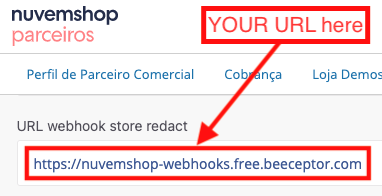
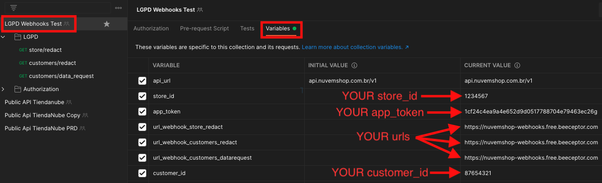
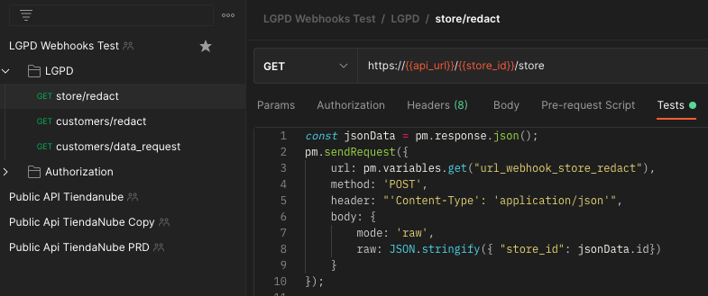
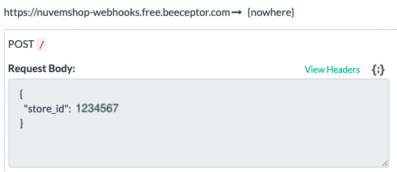
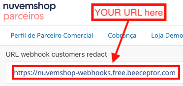
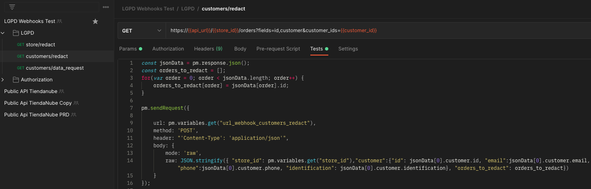
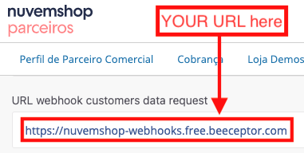
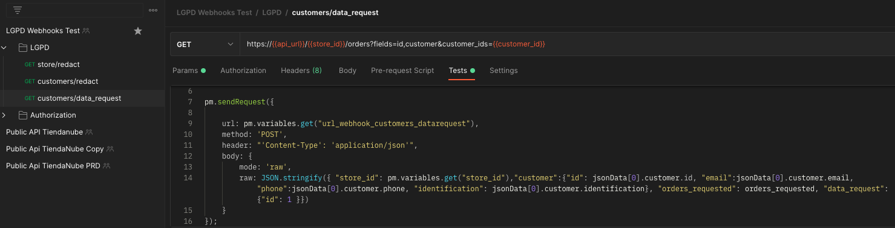
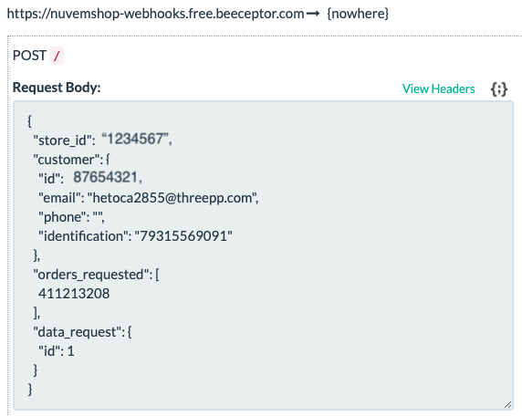

Postman Collection for LGPD Webhooks Testing
==============================================

Scope
----------------

Provide a palliative mechanism for testing LGPD webhooks for partners, as the triggering scenarios for each event depend on time or action via store Admin which are not always available at design/development time.

Test Coverage
----------------

`Partial` - This is an induced test and does not reflect action on databases, admin portals, or stores.

Complexity
----------------

`Medium` - Requires experience level in the Nuvemshop APIs to trigger events, in addition to the correct configuration of the Postman collection for the test to be successful.

Requirements
----------------

- Reading the [Webhooks documentation](https://github.com/TiendaNube/api-docs/blob/master/resources/webhook.md#required-webhooks)
- Postman [Download](https://www.postman.com/downloads/)
- LGPD Webhooks Test [Collection Import](https://github.com/TiendaNube/api-docs/tree/master/utils/lgpd-webhooks-testing-tool/lgpd_webhooks_test.json)
- Setting the environment variables of the Postman collection
- Backend available to receive events (webhooks).

---
&nbsp;
## **TEST CASES**
&nbsp;
### ***1. store/redact***

To force an app uninstall request situation (event sending **without** registration effects in the environment), it is proposed to use a request in the `GET store/redact` endpoint with a script configured in the collection pointing to the same URL registered in the `URL webhook store redact` in the App's Admin panel, which must be configured in the collection variables, as shown in the images below:

`Step 1:` To configure the variables, click on **[LGPD Webhooks Test]**, and on the right **[Variables]** tab, configure the following variables according to ***YOUR*** test scenario:

`Step 2:` In the collection's **LGPD folder**, the `GET store/redact` is prepared for a **GET /store** request with the following script on the **[Tests]** tab:

`Step 3:` After executing the request (click the ***Send*** button), the payload corresponding to the `store/redact` event will be visible in your backend, as the **example** shown below:

---
&nbsp;
### ***2. customers/redact***

To force a request situation for deletion or anonymization of customer data (event sending **without** registration effects in the environment), it is proposed to use a request on the `GET customers/redact` endpoint with a script configured in the collection pointing to the same URL registered in `URL webhook customers redact` in the App's Admin panel, which must be configured in the collection variables, as shown in the images below:

`Step 1:` To configure the variables, click on **[LGPD Webhooks Test]**, and on the right **[Variables]** tab, configure the following variables according to ***YOUR*** test scenario:

`Step 2:` In the LGPD folder of the collection, `GET customers/redact` is prepared for a request in **GET /orders?fields=id,customer&customer_ids={{customer_id}}** with the following script in the **[Tests]** tab:

`Step 3:` After executing the request (click the ***Send*** button), the payload corresponding to the `customers/redact` event will be visible in your backend, as the **example** shown below:

---
&nbsp;
### ***3. customers/data_request***

To force a customer data request situation (event sending **without** registration effects in the environment), it is proposed to use a request on the `GET customers/data_request` endpoint with a script configured in the collection pointing to the same URL registered in `URL webhook customers data request` in the App's Admin panel, which must be configured in the collection variables, as shown in the images below:

`Step 1:` To configure the variables, click on **[LGPD Webhooks Test]**, and on the right **[Variables]** tab, configure the following variables according to ***YOUR*** test scenario:

`Step 2:` In the LGPD folder of the collection, `GET customers/data_request` is prepared for a request in **GET /orders?fields=id,customer&customer_ids={{customer_id}}** with the following script in the **[Tests]** tab:

> ***Note:*** The `data_request` object is still in definition, so, by now, you can test the way it is, because it does not impact the event of sending the webhook.

`Step 3:` After executing the request (click the ***Send*** button), the payload corresponding to the `customers/data_request` event will be visible in your backend, as the **example** shown below:

---