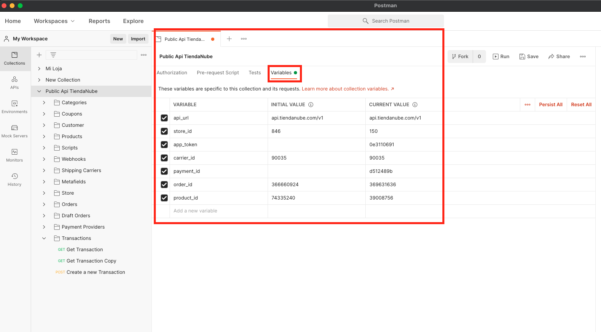

Postman Collection for {{ site.company.name }} API
==============================================

This is the file that you should import in Postman to have the skeleton of our API.

Where do I start?
----------------

Want to get started with using our collection? Here's a quick check list:

1. Download the collection.
2. Import it into Postman.
3. Change the variables inside it and use yours.
4. Start making requests.

Downloading the collection
--------------------------

<a href="{{ "./utils/postman/postman.json" | absolute_url }}" target="_blank">Download this file</a>

Import it into Postman
----------------------

Update variables
----------------
Update the variables that you need to test what you are devolping (not all are always necessary and there could be more): 

api_url (api.tiendanube.com/v1 or api.nuvemshop.com.br/v1) 
store_id 
app_token 
carrier_id 
payment_id 
order_id 
product_id

